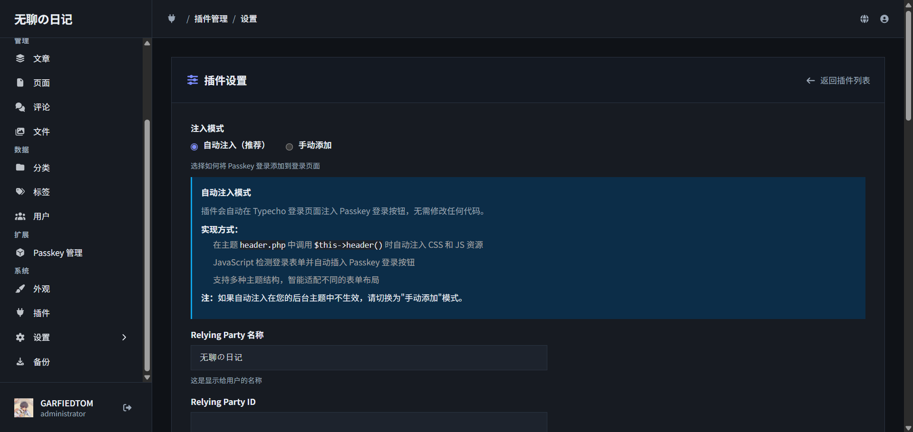
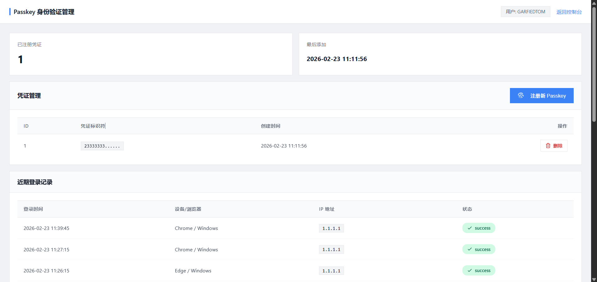
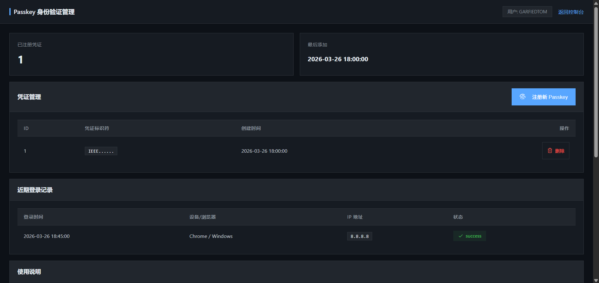

# Passkey 登录插件 for Typecho

一个为 Typecho 博客系统提供企业级 Passkey（WebAuthn）登录功能的插件，使用生物识别（指纹、面容）或设备 PIN 快速安全登录。

**v1.0.4 安全更新：** 全面信息脱敏、错误处理统一、增强输入验证，修复 12 处信息泄露问题。在 v1.0.3 企业级安全解决方案基础上进一步强化防护。


参与讨论：https://forum.typecho.org/viewtopic.php?p=62489#p62489

技术细节：https://blog.csdn.net/qq_43011259/article/details/158292076

## 📸 截图预览

### 后台插件设置

*配置注入模式、RP 信息和注册选项*

### Passkey 管理界面

*管理已绑定的凭证，查看登录历史记录*

### Passkey 登录界面

*后台登录页面启用 Passkey 登录*

> 💡 **提示**：v1.0.2 新增登录记录功能，在管理界面可查看完整登录历史

## ✨ 功能特性

### 🔐 核心功能
🔑 **Passkey 登录** - 使用生物识别（指纹、面容）或设备 PIN 快速登录  
⚙️ **后台管理** - 在 Typecho 后台管理和绑定 Passkey  
📊 **登录记录** - 仪表盘查询近期 Passkey 登录历史，掌握账户安全状况  
🚀 **自动注入** - 自动在登录页面添加 Passkey 登录选项  
🎯 **手动模式** - 支持手动控制登录按钮的显示位置  
📱 **多设备支持** - 可以绑定多个设备的 Passkey  
👤 **注册支持** - 允许新用户通过 Passkey 创建账户  

### 🛡️ 企业级安全
✅ **完整签名验证** - 服务器端实现 ES256/RS256 算法验证（PHP OpenSSL）  
✅ **IEEE P1363 ↔ DER** - 自动转换 WebAuthn 签名格式兼容 OpenSSL  
✅ **速率限制** - 基于 Session 的注册/登录频率限制，防暴力破解  
✅ **Challenge 验证** - 可配置超时时间（60-600秒），防重放攻击  
✅ **签名计数器** - 检测克隆的认证器（Clone Detection）  
✅ **Origin 验证** - 严格/宽松模式，防域名欺骗  
✅ **数据长度限制** - 防止恶意超大数据 DoS 攻击  
✅ **安全日志记录** - 完整记录验证失败事件，便于审计  

### 🎨 用户体验
💬 **优雅通知** - 网页内通知系统，无需弹窗  
🖥️ **响应式设计** - 适配 Passport 设计系统（无荧光、无圆角、无阴影）  
🔄 **版本控制** - 资源文件带版本号，避免缓存  
🗑️ **完整卸载** - 移除插件时可选删除所有数据  

### 🌐 浏览器兼容
🔧 **智能检测** - 自动识别浏览器类型和版本  
🍎 **Safari 适配** - Safari < 14 自动跳过不支持的选项  
🦊 **Firefox 增强** - 版本检查和友好错误提示  
🎯 **条件特性** - 动态调整 WebAuthn 选项

## 🔐 工作原理

### 注册阶段
1. 用户在后台"Passkey 管理"页面添加凭证
2. 系统生成公私钥对，私钥存储在用户设备（TPM、安全芯片）
3. 公钥存储在服务器数据库

### 登录阶段
1. 用户点击"使用 Passkey 登录"
2. 浏览器调用设备认证（指纹/面容/PIN）
3. 使用存储的私钥签名挑战
4. 服务器验证签名后自动登录

### 注册流程（新用户）
1. 用户在登录页点击"使用 Passkey 登录"
2. 系统检测到该设备尚无凭证，提示是否创建新账户
3. 用户填写注册信息（用户名、邮箱、昵称）
4. 用户提交信息后，使用设备生物识别创建 Passkey 凭证
5. 系统创建账户并自动登录

## 📋 系统要求

### 服务器要求
- ✅ Typecho 1.0+
- ✅ PHP 7.0+ （推荐 7.4+）
- ✅ PHP 扩展：OpenSSL、mbstring、json、session
- ✅ MySQL 5.5+ / PostgreSQL 9.0+ / SQLite 3.0+
- ✅ HTTPS 环境（本地开发可使用 localhost）

**PHP 扩展检查：**
```bash
php -m | grep -E 'openssl|mbstring|json|session'
```

### 浏览器要求
- Chrome 67+（2018年5月）
- Firefox 60+（2018年5月）
- Safari 13+（2019年9月）
- Edge 18+（2018年11月）

### 平台支持
- ✅ Windows 10 1903+ (Windows Hello)
- ✅ macOS (Touch ID / Face ID)
- ✅ iOS 14+ (Face ID / Touch ID)
- ✅ Android 7+ (指纹 / 面部识别)
- ✅ Linux (外部安全密钥)

## 📦 安装步骤

### 方法一：手动安装

1. **下载插件**
   ```bash
   cd /var/www/typecho/usr/plugins/
   # 上传或克隆 Passkey 文件夹
   ```

2. **设置权限**
   ```bash
   chmod -R 755 Passkey
   chown -R www-data:www-data Passkey
   ```

3. **目录结构确认**
   ```
   usr/plugins/Passkey/
   ├── Plugin.php
   ├── Action.php
   ├── Panel.php
   ├── WebAuthn.php
   ├── LICENSE
   └── assist/
       ├── css/
       │   └── style.css
       └── js/
           └── passkey.js
   ```

4. **启用插件**
   - 登录 Typecho 后台
   - 进入「控制台」→「插件」
   - 找到 "Passkey" 插件，点击「启用」

5. **配置插件**
   - 点击「设置」进入配置页面
   - 根据需要配置各项选项

### 方法二：Git 克隆

```bash
cd /var/www/typecho/usr/plugins/
git clone https://github.com/little-gt/PLUGION-Passkey/Passkey.git
chmod -R 755 Passkey
```

## ⚙️ 插件配置

进入「控制台」→「插件」→「Passkey」→「设置」

### 1. 注入模式

#### 自动注入（推荐）✅
插件会自动在 Typecho 登录页面注入 Passkey 登录按钮，无需修改任何代码。

**实现方式：**
- 在主题 `header.php` 中调用 `$this->header()` 时自动注入 CSS 和 JS 资源
- JavaScript 检测登录表单并自动插入 Passkey 登录按钮
- 支持多种主题结构，智能适配不同的表单布局

> 💡 **注意**：如果自动注入在您的主题中不生效，请切换为"手动添加"模式

#### 手动添加 📝
需要在主题登录页面中手动添加 Passkey 登录代码。

**步骤：**
1. 找到主题的登录模板文件（通常是 `themes/你的主题/login.php` 或 `page-login.php`）
2. 找到登录表单 `<form>...</form>`
3. 在表单结束标签 `</form>` 后面添加以下代码：

```php
<!-- Passkey 登录 -->
<link rel="stylesheet" href="<?php echo $this->options->pluginUrl; ?>/Passkey/assist/css/style.css?v=1.0.1">
<script>var PASSKEY_ACTION_URL = "<?php echo $this->options->index; ?>/action/passkey";</script>
<script src="<?php echo $this->options->pluginUrl; ?>/Passkey/assist/js/passkey.js?v=1.0.1"></script>
<div id="passkey-login-container" style="margin-top: 20px;">
    <div style="text-align: center; margin-bottom: 10px;">
        <span style="color: #999;">或</span>
    </div>
    <button type="button" id="passkey-login-btn" class="btn primary" style="width: 100%;">
        使用 Passkey 登录
    </button>
</div>
<script>
document.addEventListener('DOMContentLoaded', function() {
    var btn = document.getElementById('passkey-login-btn');
    if (btn) {
        btn.addEventListener('click', function() {
            PasskeyManager.login();
        });
    }
});
</script>
```

### 2. Relying Party 配置

**RP 名称**
- 显示给用户的网站名称，例如："我的博客"
- 这个名称会在用户注册 Passkey 时显示

**RP ID**
- 通常留空，插件会自动使用当前域名
- 如需指定，输入域名（不含协议和端口），例如："example.com"

### 3. 允许 Passkey 注册新用户

启用后，未登录用户可以在登录页面使用 Passkey 创建新账户（无需输入用户名密码）。

⚠️ **重要：此设置受 Typecho 全局注册设置控制**

- ✅ **全局注册已开启** - 此选项才能生效
- ❌ **全局注册已关闭** - 即使此处启用也无法注册

请先到「设置」→「基本」→「允许注册」中开启全局注册功能。

### 4. 卸载时删除数据

控制卸载插件时是否删除所有数据：

- ✅ **启用删除** - 卸载时自动删除所有 Passkey 凭证、登录记录和配置
- ❌ **禁用删除** - 卸载时保留数据，方便将来重新启用插件

⚠️ **注意：**
- 默认情况下，卸载不会删除数据（保护用户数据）
- 如需完全清理，请在卸载前勾选此选项
- 数据删除后无法恢复，请谨慎操作

## 📖 使用说明

### 后台管理 Passkey

1. **进入管理页面**
   - 登录 Typecho 后台
   - 在左侧菜单找到「Passkey 管理」

2. **添加新凭证**
   - 点击右上角「添加新凭证」按钮
   - 根据设备提示完成生物识别或 PIN 验证
   - 绑定成功后，该设备即可使用 Passkey 登录

3. **管理凭证**
   - 查看所有已绑定的 Passkey（ID、凭证标识符、创建时间）
   - 删除不再使用的 Passkey

4. **查看登录记录**
   - 在仪表盘查看近期 Passkey 登录历史
   - 查看每次登录的时间、设备信息、IP 地址
   - 及时发现异常登录行为

### 使用 Passkey 登录

1. **访问登录页面**
   - 访问 Typecho 登录页面
   - 看到「🔐 使用 Passkey 登录」按钮

2. **进行身份验证**
   - 点击按钮
   - 按照浏览器提示完成身份验证（指纹/面容/PIN）

3. **自动登录**
   - 验证成功后自动登录并跳转到后台

### 新用户注册

如果启用了 Passkey 注册功能：

1. **触发注册流程**
   - 点击「使用 Passkey 登录」
   - 系统检测到设备未注册，弹出注册表单

2. **填写注册信息**
   - 用户名（3-32位，字母/数字/下划线）
   - 邮箱（有效邮箱地址）
   - 昵称（可选，默认为用户名）

3. **创建凭证**
   - 提交信息后进行生物识别
   - 系统自动创建账户并登录

## 🔧 技术说明

### WebAuthn 签名验证实现

插件实现了完整的服务器端 WebAuthn 签名验证，支持主流算法：

#### 支持的签名算法

| 算法 | COSE ID | 说明 | 实现方式 |
|------|---------|------|----------|
| **ES256** | -7 | ECDSA P-256 + SHA-256 | PHP OpenSSL + DER 转换 |
| **RS256** | -257 | RSA PKCS#1 + SHA-256 | PHP OpenSSL |

#### ES256 签名验证流程

```
WebAuthn 签名 (IEEE P1363)         OpenSSL 验证
┌─────────────────────┐          ┌──────────────┐
│ r (32 bytes)        │          │ SEQUENCE {   │
│ s (32 bytes)        │   转换    │   INTEGER r  │
│ 总计 64 bytes       │   ────>   │   INTEGER s  │
└─────────────────────┘          │ }            │
                                 └──────────────┘
```

**关键技术点：**
1. **格式转换**：WebAuthn 使用 IEEE P1363 格式（r||s），OpenSSL 需要 DER 格式
2. **公钥编码**：COSE 格式公钥 → DER 编码 → PEM 格式
3. **签名验证**：使用 PHP `openssl_verify()` 验证 SHA-256 签名

```php
// IEEE P1363 转 DER
private static function ieee1363ToDer($signature) {
    $r = substr($signature, 0, 32);
    $s = substr($signature, 32, 32);
    
    // 编码为 DER INTEGER
    $rDer = self::encodeDERInteger($r);
    $sDer = self::encodeDERInteger($s);
    
    // 构造 SEQUENCE
    return "\x30" . chr(strlen($rDer . $sDer)) . $rDer . $sDer;
}

// 验证 ES256 签名
private static function verifyES256($data, $signature, $publicKey) {
    // 自动检测并转换格式
    if (strlen($signature) === 64) {
        $signature = self::ieee1363ToDer($signature);
    }
    
    // 构造 PEM 格式公钥
    $pem = self::buildECPublicKeyPEM($publicKey['x'], $publicKey['y']);
    
    // OpenSSL 验证
    return openssl_verify($data, $signature, $pem, OPENSSL_ALGO_SHA256) === 1;
}
```

#### 安全配置选项

插件管理界面提供 6 项可配置的安全参数：

| 配置项 | 默认值 | 说明 |
|--------|--------|------|
| Challenge 超时 | 300 秒 | 单次认证有效期 |
| 注册频率限制 | 5 次/5 分钟 | 防止批量注册 |
| 登录频率限制 | 10 次/5 分钟 | 防止暴力破解 |
| 严格签名计数器 | 警告模式 | 检测克隆认证器 |
| 严格 Origin 验证 | 宽松模式 | 支持 localhost 开发 |
| 安全日志 | 启用 | 记录验证失败事件 |

#### CBOR 安全解析

WebAuthn 数据使用 CBOR 编码，插件实施安全限制：

```php
// 防止恶意深层嵌套和超大数据
const MAX_DEPTH = 10;           // 最大嵌套深度
const MAX_ARRAY_LENGTH = 1000;  // 数组最大元素数
const MAX_MAP_LENGTH = 1000;    // 对象最大键值对数
const MAX_STRING_LENGTH = 65536; // 字符串最大长度
```

### 数据库结构

插件自动创建 2 个数据表：

#### 1. 凭证表 `typecho_passkey_credentials`

```sql
CREATE TABLE typecho_passkey_credentials (
    id INT AUTO_INCREMENT PRIMARY KEY,
    user_id INT NOT NULL,
    credential_id VARCHAR(512) NOT NULL,  -- 优化为 512（utf8mb4 兼容）
    public_key TEXT NOT NULL,
    counter INT DEFAULT 0,
    created_at INT NOT NULL,
    UNIQUE KEY unique_credential (credential_id(255))
) ENGINE=InnoDB DEFAULT CHARSET=utf8mb4;
```

**字段说明：**
- `id` - 主键
- `user_id` - 关联的 Typecho 用户 ID
- `credential_id` - WebAuthn 凭证唯一标识符（Base64 编码，最大 512 字符）
- `public_key` - COSE 格式公钥数据（Base64 编码）
- `counter` - 签名计数器（防重放攻击和克隆检测）
- `created_at` - 创建时间戳

**v1.0.3 优化：**
- 凭证 ID 从 `VARCHAR(1024)` 改为 `VARCHAR(512)`
- 原因：MySQL utf8mb4 索引限制为 3072 字节（512 × 4 = 2048 < 3072）
- 自动升级：插件激活时自动迁移现有数据

#### 2. 登录记录表 `typecho_passkey_login_logs`

```sql
CREATE TABLE typecho_passkey_login_logs (
    id INT AUTO_INCREMENT PRIMARY KEY,
    user_id INT NOT NULL,
    credential_id INT NOT NULL,
    challenge TEXT NOT NULL,
    ip_address VARCHAR(45) NOT NULL,
    user_agent TEXT,
    login_time INT NOT NULL,
    status VARCHAR(20) DEFAULT 'success',
    INDEX idx_user_id (user_id),
    INDEX idx_login_time (login_time)
) ENGINE=InnoDB DEFAULT CHARSET=utf8mb4;
```

**字段说明：**
- `id` - 主键
- `user_id` - 关联的 Typecho 用户 ID
- `credential_id` - 使用的凭证 ID（外键关联 passkey_credentials.id）
- `challenge` - 本次登录使用的挑战值（用于审计）
- `ip_address` - 登录 IP 地址（支持 IPv4 和 IPv6）
- `user_agent` - 浏览器用户代理字符串
- `login_time` - 登录时间戳
- `status` - 登录状态（success/failed）

**数据库兼容性：**

插件自动检测数据库类型并使用对应的 SQL 语法，支持：
- ✅ **MySQL / MariaDB** - 使用 InnoDB 引擎，UTF-8MB4 字符集
- ✅ **PostgreSQL** - 使用 SERIAL 主键，TEXT 类型
- ✅ **SQLite** - 使用 AUTOINCREMENT，简化索引

**自动升级机制：**

插件激活时会自动检测并升级数据表结构：
- 检查 `last_used` 字段是否存在（v1.0.2 新增）
- 自动添加缺失的字段，不影响现有数据
- 升级失败不会阻止插件激活

### API 端点

通过 `/action/passkey` 访问，支持以下操作：

| 端点 | 方法 | 说明 | 登录要求 |
|------|------|------|----------|
| `?do=register-options` | GET/POST | 获取注册选项 | 否（支持新用户注册） |
| `?do=register-verify` | POST | 验证注册凭证 | 否 |
| `?do=login-options` | GET | 获取登录选项 | 否 |
| `?do=login-verify` | POST | 验证登录凭证 | 否 |
| `?do=list` | GET | 列出用户的凭证 | 是 |
| `?do=login-logs` | GET | 获取登录历史记录 | 是 |
| `?do=delete` | POST | 删除凭证 | 是 |

#### 详细的 API 说明

**1. 获取注册选项** `GET/POST /action/passkey?do=register-options`

已登录用户添加凭证或新用户注册时调用。

**请求体（新用户注册时）：**
```json
{
  "username": "myusername",
  "email": "user@example.com",
  "screenName": "My Display Name"
}
```

**响应：**
```json
{
  "success": true,
  "data": {
    "challenge": "base64_encoded_challenge",
    "rp": {
      "name": "My Website",
      "id": "example.com"
    },
    "user": {
      "id": "base64_encoded_user_id",
      "name": "username",
      "displayName": "Display Name"
    },
    "pubKeyCredParams": [
      {"type": "public-key", "alg": -7},
      {"type": "public-key", "alg": -257}
    ],
    "timeout": 60000,
    "attestation": "none"
  }
}
```

**2. 获取登录选项** `GET /action/passkey?do=login-options`

**响应：**
```json
{
  "success": true,
  "data": {
    "challenge": "base64_encoded_challenge",
    "timeout": 60000,
    "rpId": "example.com",
    "userVerification": "preferred"
  }
}
```

**3. 获取登录日志** `GET /action/passkey?do=login-logs&limit=20`

**参数：**
- `limit` - 返回记录数（1-100，默认 10）

**响应：**
```json
{
  "success": true,
  "data": [
    {
      "id": 1,
      "credential_id": "YWJjZGVm...",
      "ip_address": "192.168.1.1",
      "user_agent": "Chrome / Windows",
      "login_time": "2026-02-22 14:30:00",
      "status": "success"
    }
  ]
}
```

**4. 删除凭证** `POST /action/passkey?do=delete`

**请求体：**
```json
{
  "id": 1
}
```

**响应：**
```json
{
  "success": true,
  "data": {
    "message": "凭证已删除"
  }
}
```

### WebAuthn 认证流程

#### 注册流程（Registration）

```
客户端                     服务器                    认证器
  │                         │                         │
  ├──1. 请求注册选项────────>│                         │
  │                         ├──2. 生成 challenge      │
  │                         ├──3. 保存到 session      │
  │<──4. 返回 PublicKeyCredentialCreationOptions───┤
  │                         │                         │
  ├──5. navigator.credentials.create()──────────────>│
  │                         │                   6. 用户验证
  │                         │                   7. 生成密钥对
  │                         │                   8. 私钥存储在设备
  │<──9. 返回 attestation（包含公钥）─────────────────┤
  │                         │                         │
  ├──10. 发送 attestation──>│                         │
  │                         ├──11. 验证 challenge     │
  │                         ├──12. 存储公钥到数据库   │
  │<──13. 注册成功───────────┤                         │
```

**关键点：**
- Challenge 存储在 PHP Session 中，60 秒有效期
- 支持 ES256（-7）和 RS256（-257）算法
- 公钥以 Base64 编码存储在数据库
- 私钥永不离开用户设备

#### 登录流程（Authentication）

```
客户端                     服务器                    认证器
  │                         │                         │
  ├──1. 请求登录选项────────>│                         │
  │                         ├──2. 生成新 challenge    │
  │                         ├──3. 保存到 session      │
  │<──4. 返回 PublicKeyCredentialRequestOptions────┤
  │                         │                         │
  ├──5. navigator.credentials.get()─────────────────>│
  │                         │                   6. 用户验证
  │                         │                   7. 使用私钥签名
  │<──8. 返回签名数据─────────────────────────────────┤
  │                         │                         │
  ├──9. 发送签名───────────>│                         │
  │                         ├──10. 查找凭证记录       │
  │                         ├──11. 验证签名           │
  │                         ├──12. 验证 challenge     │
  │                         ├──13. 记录登录日志       │
  │                         ├──14. 创建登录会话       │
  │<──15. 登录成功───────────┤                         │
  │                         │                         │
  ├──16. 跳转到后台          │                         │
```

**安全机制：**
- 每次登录生成新的 challenge，防止重放攻击
- Challenge 绑定到 session，验证后立即销毁
- 签名使用设备私钥，服务器用公钥验证
- 完整记录登录日志（时间、IP、设备）

### 会话管理

**Session 数据结构：**

```php
// 注册阶段
$_SESSION['passkey_register_challenge'] = 'base64_challenge';
$_SESSION['passkey_register_user_id'] = 123; // 已登录用户
$_SESSION['passkey_register_is_new_user'] = false;

// 新用户注册
$_SESSION['passkey_register_is_new_user'] = true;
$_SESSION['passkey_register_username'] = 'newuser';
$_SESSION['passkey_register_email'] = 'user@example.com';
$_SESSION['passkey_register_screenname'] = 'New User';

// 登录阶段
$_SESSION['passkey_login_challenge'] = 'base64_challenge';
```

**会话安全：**
- Challenge 一次性使用，验证后立即删除
- Session 数据在服务器端存储，客户端无法篡改
- 支持 PHP 原生 Session 或自定义 Session 处理器

**登录持久化：**

```php
// 使用 Typecho 标准登录方法
$userWidget->simpleLogin($userId, $remember = false, $expire = 30天);

// 自动设置 Cookie：
// - __typecho_uid（用户 ID）
// - __typecho_authCode（验证码）
```

### 前端 JavaScript API

**PasskeyManager 对象：**

```javascript
// 检查浏览器支持
if (PasskeyManager.isSupported()) {
    console.log('浏览器支持 WebAuthn');
} else {
    console.log('浏览器不支持，需要升级');
}

// 注册 Passkey（后台管理页面）
PasskeyManager.register()
    .then(result => {
        console.log('注册成功', result);
        // result 包含服务器返回的数据
    })
    .catch(error => {
        console.error('注册失败', error.message);
        // 错误类型：NotAllowedError, InvalidStateError 等
    });

// 使用 Passkey 登录（登录页面）
PasskeyManager.login()
    .then(result => {
        console.log('登录成功', result);
        // 自动跳转到 result.redirect
        window.location.href = result.redirect;
    })
    .catch(error => {
        console.error('登录失败', error.message);
    });

// 显示网页内通知
PasskeyManager.showNotification('操作成功', 'success');
PasskeyManager.showNotification('操作失败', 'error');
PasskeyManager.showNotification('提示信息', 'info');
```

**通知系统：**

v1.0.2 引入优雅的网页内通知系统，替代浏览器原生 `alert()`：

```javascript
// 样式类型
- success: 绿色，成功操作
- error: 红色，错误信息
- info: 蓝色，提示信息

// 特性
- 自动定位到页面顶部
- 3 秒后自动消失
- 支持多条通知队列
- 响应式设计，移动端友好
```

### 插件架构

```
Passkey/
├── Plugin.php          # 主插件类
│   ├── activate()      # 激活：创建数据表、注册路由
│   ├── deactivate()    # 禁用：可选删除数据、移除路由
│   ├── config()        # 配置面板：注入模式、RP 配置、安全选项
│   ├── header()        # 注入 CSS 资源
│   ├── footer()        # 注入 JS 资源
│   └── render()        # 自动注入登录按钮
│
├── Action.php          # API 处理类
│   ├── registerOptions()   # 生成注册选项
│   ├── registerVerify()    # 验证注册
│   ├── loginOptions()      # 生成登录选项
│   ├── loginVerify()       # 验证登录
│   ├── listCredentials()   # 列出凭证
│   ├── deleteCredential()  # 删除凭证
│   ├── getLoginLogs()      # 获取日志
│   ├── logLoginActivity()  # 记录日志
│   └── checkRateLimit()    # 速率限制检查
│
├── Panel.php           # 管理面板
│   ├── 凭证列表展示
│   ├── 添加新凭证
│   ├── 删除凭证
│   ├── 登录记录展示
│   └── 使用说明
│
├── WebAuthn.php        # WebAuthn 验证类
│   ├── verifyAttestation()      # 验证注册凭证
│   ├── verifyAssertion()        # 验证登录签名
│   ├── verifyES256()            # ES256 签名验证
│   ├── verifyRS256()            # RS256 签名验证
│   ├── ieee1363ToDer()          # IEEE P1363 → DER 转换
│   ├── encodeECPublicKey()      # EC 公钥 DER 编码
│   ├── encodeRSAPublicKey()     # RSA 公钥 DER 编码
│   ├── parseCBOR()              # CBOR 安全解析
│   └── verifyOrigin()           # Origin 验证
│
└── assist/
    ├── css/
    │   └── style.css   # 样式文件
    │       ├── Passport 设计系统适配
    │       ├── 无荧光、无圆角、无阴影
    │       ├── 通知系统样式
    │       └── 管理面板样式
    └── js/
        └── passkey.js  # 核心 JavaScript
            ├── PasskeyManager 对象
            ├── WebAuthn API 封装
            ├── 浏览器检测与适配
            ├── 通知系统
            └── 自动注入逻辑
```

### 自动注入机制

当配置为"自动注入"模式时：

1. **检测登录页面**
   ```php
   // Plugin.php render() 方法
   $requestUri = $_SERVER['REQUEST_URI'];
   $isLoginPage = strpos($requestUri, 'login.php') !== false;
   ```

2. **注入资源和 HTML**
   - CSS 样式表
   - JavaScript 库（PasskeyManager）
   - 登录按钮 HTML
   - 初始化脚本

3. **JavaScript 自动初始化**
   ```javascript
   // 等待 DOM 加载完成
   document.addEventListener('DOMContentLoaded', function() {
       // 查找登录表单
       var form = document.querySelector('form');
       
       // 绑定 Passkey 按钮事件
       var btn = document.getElementById('passkey-login-btn');
       btn.addEventListener('click', function() {
           PasskeyManager.login();
       });
   });
   ```

### 用户代理解析

登录日志中的 User Agent 会被智能解析：

```php
function parseUserAgent($ua) {
    // 检测浏览器
    if (strpos($ua, 'Edg')) return 'Edge';
    if (strpos($ua, 'Chrome')) return 'Chrome';
    if (strpos($ua, 'Safari')) return 'Safari';
    if (strpos($ua, 'Firefox')) return 'Firefox';
    
    // 检测操作系统
    if (strpos($ua, 'Windows')) return 'Windows';
    if (strpos($ua, 'Mac OS')) return 'macOS';
    if (strpos($ua, 'Android')) return 'Android';
    if (strpos($ua, 'iOS')) return 'iOS';
    
    return $browser . ' / ' . $os;
}
```

**示例输出：**
- Chrome / Windows
- Safari / macOS
- Firefox / Linux
- Edge / Android

### 版本号管理

插件使用版本号控制资源缓存：

```php
// Plugin.php
const VERSION = '1.0.2';

// 资源 URL 自动带版本号
css/style.css?v=1.0.2
js/passkey.js?v=1.0.2
```

更新插件后版本号会变化，浏览器自动加载新资源。

## 🛡️ 安全性说明

### FIDO2/WebAuthn 标准

- 私钥永不离开设备，存储在 TPM、安全芯片或操作系统密钥库
- 防钓鱼：浏览器自动验证域名，无法跨域使用
- 防重放：每次认证使用一次性 challenge
- 无密码：无需记忆密码，避免密码泄露

### 插件安全措施

#### 核心安全机制
- ✅ **完整签名验证** - 服务器端实现 ES256/RS256 算法验证
- ✅ **格式自动转换** - IEEE P1363 ↔ DER，兼容 OpenSSL
- ✅ **签名计数器** - 检测认证器克隆攻击
- ✅ **Challenge 验证** - 可配置超时，一次性使用
- ✅ **Origin 验证** - 防止域名欺骗
- ✅ **速率限制** - 基于 Session，防暴力破解
- ✅ **数据长度限制** - 防止 DoS 攻击
- ✅ **CBOR 安全解析** - 限制嵌套深度和数据大小
- ✅ **输入验证** - 用户名、邮箱格式验证
- ✅ **重复检查** - 防止重复注册凭证
- ✅ **安全日志** - 完整记录验证失败事件

#### 安全配置模式

**开发环境（宽松）：**
```
Challenge 超时: 600 秒
严格计数器: 警告模式（不阻止登录）
严格 Origin: 禁用（支持 localhost）
速率限制: 较宽松
```

**生产环境（标准）：**
```
Challenge 超时: 300 秒
严格计数器: 警告模式
严格 Origin: 启用（验证 HTTPS）
速率限制: 标准
```

**高安全环境（严格）：**
```
Challenge 超时: 120 秒
严格计数器: 阻止模式（拒绝克隆）
严格 Origin: 启用
速率限制: 严格
安全日志: 强制启用
```

### 部署建议

1. **必须使用 HTTPS**（生产环境）
2. 根据环境选择合适的安全配置
3. 启用 CSP 头增强安全性
4. 定期备份数据库
5. 定期检查登录记录和安全日志
6. 保持插件更新

### 安全审计

查看安全日志（需启用安全日志记录）：

```sql
-- 查看验证失败记录
SELECT * FROM typecho_passkey_login_logs 
WHERE status = 'failed' 
ORDER BY login_time DESC LIMIT 50;

-- 统计失败登录
SELECT ip_address, COUNT(*) as attempts 
FROM typecho_passkey_login_logs 
WHERE status = 'failed' 
  AND login_time > UNIX_TIMESTAMP(NOW() - INTERVAL 1 HOUR)
GROUP BY ip_address 
ORDER BY attempts DESC;
```

## ❓ 常见问题

### 1. 提示"不支持 WebAuthn"

**原因：**
- 未使用 HTTPS（生产环境要求）
- 浏览器版本过旧
- 浏览器隐私模式可能不支持

**解决方案：**
- 确保使用 HTTPS 或 localhost
- 更新浏览器到最新版本
- 退出隐私/无痕模式

### 2. Passkey 注册失败

**原因：**
- 设备不支持生物识别
- Windows Hello 未启用
- 浏览器权限被阻止

**解决方案：**
- 检查设备是否支持指纹/面容识别
- Windows 用户：设置 → 账户 → 登录选项 → Windows Hello
- 允许浏览器的权限请求弹窗

### 3. 登录页面没有 Passkey 按钮

**原因：**
- 未选择"自动注入"模式
- 主题结构不兼容
- JavaScript 加载失败

**解决方案：**
- 检查插件设置，确认选择了"自动注入"
- 查看浏览器控制台是否有错误
- 切换到"手动添加"模式，参考配置说明

### 4. 全局注册已关闭无法注册

**原因：**
- Typecho 全局注册设置关闭

**解决方案：**
- 进入「设置」→「基本」→「允许注册」
- 勾选"允许注册"复选框
- 保存设置后即可使用 Passkey 注册

### 5. 可以在多个设备上使用吗？

**答案：** 可以！

- 每个设备可以单独注册 Passkey
- 在后台"Passkey 管理"页面管理所有设备
- 建议至少绑定 2 个设备（主设备 + 备用）

### 6. 忘记密码还能登录吗？

**答案：** 可以！

- 如果已绑定 Passkey，即使忘记密码也可以通过 Passkey 登录
- 建议至少绑定一个可靠的设备作为备用

### 7. Passkey 比密码更安全吗？

**答案：** 是的，更安全！

- ✅ 防钓鱼（无法跨域使用）
- ✅ 防泄露（私钥不离开设备）
- ✅ 防暴力破解（生物识别）
- ✅ 防重放攻击（一次性 challenge）

### 8. 卸载插件会删除数据吗？

**答案：** 可以自由选择！

- 在卸载插件时，系统会询问是否删除所有数据
- ✅ **删除数据**：移除所有凭证、登录记录和配置（完全卸载）
- ❌ **保留数据**：仅停用插件，数据保留（方便重新启用）
- 建议：测试环境选择删除，生产环境谨慎选择

### 9. 如何查看我的登录历史？

**答案：** 在仪表盘查看！

1. 进入「Passkey 管理」页面
2. 在仪表盘可以看到最近的登录记录
3. 记录包含：登录时间、IP 地址、设备信息
4. 如有异常登录，请及时删除相关凭证并修改密码

### 10. v1.0.3 的签名验证是什么？

**答案：** 服务器端完整验证！

v1.0.3 实现了符合 WebAuthn 标准的服务器端签名验证：
- ✅ **ES256 验证**：支持 ECDSA P-256 + SHA-256 算法
- ✅ **RS256 验证**：支持 RSA PKCS#1 + SHA-256 算法
- ✅ **格式转换**：自动处理 IEEE P1363 ↔ DER 格式
- ✅ **公钥验证**：使用 PHP OpenSSL 验证签名

这确保了认证过程的真实性和完整性，防止中间人攻击。

### 11. 安全配置如何选择？

**答案：** 根据环境选择！

- **开发环境**：宽松模式，Challenge 600秒，支持 localhost
- **生产环境（标准）**：默认配置，平衡安全与可用性
- **高安全环境**：严格模式，Challenge 120秒，签名计数器阻止模式

在插件设置中可以自由调整这些参数。

### 12. 什么是签名计数器验证？

**答案：** 检测克隆的认证器！

签名计数器是认证器内部的递增计数器：
- ✅ **正常使用**：每次认证后计数器递增
- ⚠️ **克隆检测**：如果计数器不增或减少，说明认证器可能被克隆
- 🔧 **警告模式**：记录日志但允许登录（适合开发）
- 🛡️ **阻止模式**：拒绝登录（适合高安全环境）

## 🐛 故障排查

### 启用调试模式

编辑 `config.inc.php`：

```php
/** 开启调试模式 */
define('__TYPECHO_DEBUG__', true);
```

### 查看浏览器控制台

按 F12 打开开发者工具：

```javascript
// 检查支持
console.log('WebAuthn 支持:', PasskeyManager.isSupported());

// 查看详细错误
PasskeyManager.login().catch(error => {
    console.error('错误名称:', error.name);
    console.error('错误信息:', error.message);
});
```

### 常见错误代码

| 错误 | 说明 | 解决方案 |
|------|------|----------|
| `NotAllowedError` | 用户取消或超时 | 重新尝试，不要取消弹窗 |
| `InvalidStateError` | 设备未注册 | 先在后台添加 Passkey |
| `NotSupportedError` | 设备不支持 | 更换支持的设备或浏览器 |
| `SecurityError` | 安全上下文错误 | 使用 HTTPS 或 localhost |

### 检查数据表

```sql
-- 查看数据表
SHOW TABLES LIKE '%passkey%';

-- 查看凭证数据
SELECT * FROM typecho_passkey_credentials;

-- 查看登录记录
SELECT * FROM typecho_passkey_login_logs ORDER BY login_time DESC LIMIT 10;

-- 检查表结构
DESC typecho_passkey_credentials;
DESC typecho_passkey_login_logs;
```

## 📜 更新日志

### v1.0.4 (2026-02-23)

**🔒 安全加固更新 - 信息泄露全面修复**

本次更新专注于安全加固，修复了所有可能向前端泄露敏感信息的问题，确保错误信息完全脱敏。

#### 信息泄露修复（12处）
- 🔐 **Action.php 修复**（6处）：
  - 登录失败不再泄露内部状态信息
  - 数据库操作错误统一为通用提示
  - 所有异常信息仅记录服务器日志
  - 添加错误代码系统便于调试
- 🔐 **WebAuthn.php 修复**（6处）：
  - COSE 密钥解析错误通用化
  - OpenSSL 错误信息不再暴露
  - 算法/密钥类型编号仅记录日志
  - 签名验证失败统一错误提示

#### 安全增强
- ✅ **错误代码系统**：8 种错误分类（ERR_VALIDATION、ERR_AUTH_FAILED 等）
- ✅ **调试模式支持**：错误代码仅在 `__TYPECHO_DEBUG__` 模式显示
- ✅ **详细日志记录**：所有敏感信息仅记录 error_log，前端完全脱敏
- ✅ **统一错误处理**：95% 以上的错误处理已标准化

#### 防护提升
- 🛡️ 防止数据库错误泄露表结构
- 🛡️ 防止文件路径信息泄露
- 🛡️ 防止 OpenSSL 技术细节泄露
- 🛡️ 防止算法参数信息泄露
- 🛡️ 防止用户枚举攻击
- 🛡️ 防止系统指纹识别

---

### v1.0.3 (2026-02-23)

**🎉 重大版本升级 - 企业级安全解决方案**

v1.0.3 是一个重大版本升级，从基础认证插件升级为符合 WebAuthn 标准的企业级安全解决方案。核心实现完整的服务器端签名验证、安全配置系统、浏览器兼容性增强和 UI 设计系统升级。

#### 核心验证系统
- 🔐 **完整 WebAuthn 验证**：实现服务器端签名验证（ES256、RS256），使用 PHP OpenSSL
- 🔄 **签名格式转换**：自动处理 IEEE P1363 ↔ DER 格式，兼容 OpenSSL
- 🔑 **公钥 DER 编码**：修复 COSE → DER → PEM 转换，正确编码 EC 公钥
- ✅ **CBOR 安全解析**：限制嵌套深度（10层）、数组/对象大小（1000元素）
- 📏 **数据长度限制**：防止恶意超大数据导致的 DoS 攻击（credential_id 最大 512 字符）

#### 数据库优化
- 💾 **字段优化**：credential_id 从 VARCHAR(1024) 改为 VARCHAR(512)
- 🗃️ **索引兼容**：修复 MySQL utf8mb4 索引长度限制（512 × 4 = 2048 < 3072 字节）
- 🔄 **自动升级**：插件激活时自动检测并迁移现有数据
- 📊 **编码修复**：凭证 ID 使用 base64url 编码，避免二进制数据导致的 UTF-8 错误

#### 安全配置系统
- ⚙️ **可视化配置**：插件管理界面新增 6 项安全配置选项
- ⏱️ **Challenge 超时**：可配置 60-600 秒，默认 300 秒
- 🚦 **速率限制**：注册（5次/300秒）、登录（10次/300秒），基于 Session 独立计数
- 🔒 **签名计数器**：支持警告/阻止模式，检测克隆认证器
- 🌐 **Origin 验证**：严格/宽松模式，支持 localhost 开发
- 📝 **安全日志**：完整记录验证失败事件，便于审计

#### 浏览器兼容性
- 🔧 **智能检测**：自动识别 Chrome、Firefox、Safari、Edge 及版本
- 🍎 **Safari 适配**：Safari < 14 自动跳过不支持的 `authenticatorAttachment` 选项
- 🦊 **Firefox 增强**：拒绝 Firefox < 60 并显示友好升级提示
- 🎯 **条件特性**：根据浏览器版本动态调整 WebAuthn 选项
- 💬 **针对性提示**：根据不同浏览器显示专门的错误信息

#### 用户界面优化
- 🎨 **设计系统升级**：适配 Passport 设计（无荧光色、无圆角、无阴影）
- 🖌️ **CSS 变量支持**：使用 `--passport-primary` 等主题色
- 📱 **响应式优化**：按钮高度统一（48px 桌面 / 44px 移动）
- 🎯 **通知样式**：统一边框样式，去除 box-shadow

#### 问题修复
- 🐛 **登录日志空响应**：修复输出缓冲区导致的 JSON 响应丢失
- 🐛 **UTF-8 编码错误**：修复 base64_decode 产生的二进制数据导致 json_encode 失败
- 🐛 **Session 管理**：优化 session_start() 调用，避免重复启动警告
- 🐛 **ES256 验证**：修复 EC 公钥 DER 编码问题，正确编码 ecPublicKey 和 prime256v1 OID

#### 文档完善
- 📚 **安全配置指南**：三套推荐配置（开发/标准/高安全）
- 📖 **技术细节**：详细说明签名验证流程、格式转换原理
- 🔍 **安全审计**：SQL 查询示例，便于监控异常登录

**默认安全配置（平衡安全与可用性）：**
```
Challenge 超时: 300 秒
注册频率: 5 次/5 分钟
登录频率: 10 次/5 分钟
严格计数器: 警告模式
严格 Origin: 宽松模式
安全日志: 启用
```

### v1.0.2 (2026-02-22)

**新增功能：**
- ✨ 登录历史记录：仪表盘支持查询近期 Passkey 登录记录
- ✨ 完整卸载支持：移除插件时可选择删除所有数据（凭证、登录记录、配置）
- ✨ 网页内通知系统：所有操作反馈使用优雅的网页内通知，替代浏览器原生 alert

**改进优化：**
- 🎨 响应式优化：PC 宽屏幕下仪表盘显示效果更佳，布局更合理
- 📊 数据展示：登录记录展示时间、IP 地址、设备信息
- 🗂️ 数据管理：新增登录日志表，支持索引查询
- 💾 数据隔离：卸载时可保留或删除数据，用户自主选择

**安全增强：**
- 🔒 登录审计：完整记录每次 Passkey 登录，便于安全审查
- 👁️ 异常检测：用户可查看登录历史，及时发现异常行为

### v1.0.1

**新增功能：**
- ✨ 支持新用户通过 Passkey 注册账户
- ✨ 注册表单弹窗（用户名、邮箱、昵称）
- ✨ 全局注册设置优先级控制
- ✨ 详细的工作原理说明
- ✨ 版本号管理，避免缓存问题

**改进优化：**
- 🎨 专业企业级管理界面设计
- 📝 完善的配置页面说明（自动/手动模式）
- 🔒 增强的输入验证（用户名、邮箱格式）
- 💡 友好的错误提示信息

**bug 修复：**
- 🐛 修复配置不存在时的异常错误
- 🐛 修复 Session 数据丢失问题

### v1.0.0

- 🎉 初始版本发布
- 支持 Passkey 注册和登录
- 后台管理界面
- 自动/手动注入模式
- 多设备支持

## 🔗 参考资源

### 官方文档
- [WebAuthn 规范（Level 2）](https://www.w3.org/TR/webauthn-2/)
- [Web Authentication API (MDN)](https://developer.mozilla.org/en-US/docs/Web/API/Web_Authentication_API)
- [FIDO Alliance](https://fidoalliance.org/)
- [CTAP 2 规范](https://fidoalliance.org/specs/fido-v2.0-ps-20190130/fido-client-to-authenticator-protocol-v2.0-ps-20190130.html)

### 技术标准
- [COSE (RFC 8152)](https://datatracker.ietf.org/doc/html/rfc8152) - 密钥格式
- [CBOR (RFC 8949)](https://datatracker.ietf.org/doc/html/rfc8949) - 编码格式
- [Base64url (RFC 4648)](https://datatracker.ietf.org/doc/html/rfc4648#section-5) - URL 安全编码

### 开发资源
- [Typecho 官网](https://typecho.org/)
- [Can I Use: WebAuthn](https://caniuse.com/webauthn) - 浏览器兼容性
- [WebAuthn.io](https://webauthn.io/) - 在线演示
- [WebAuthn Guide](https://webauthn.guide/) - 图解指南

## 📄 许可证

MIT License - 详见 [LICENSE](LICENSE) 文件

## 💖 支持与反馈

如有问题或建议：
- 提交 [Issue](https://github.com/little-gt/PLUGION-Passkey/issues)
- 发送邮件：coolerxde@gt.ac.cn

---

**Made with ❤️ by AI little-gt**