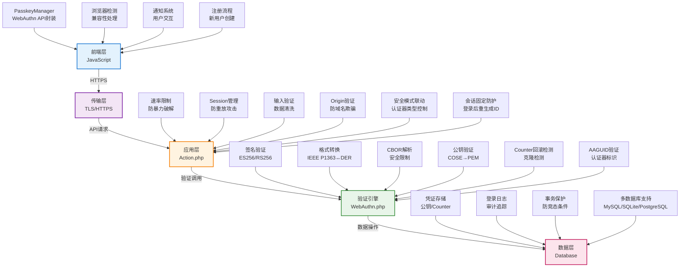
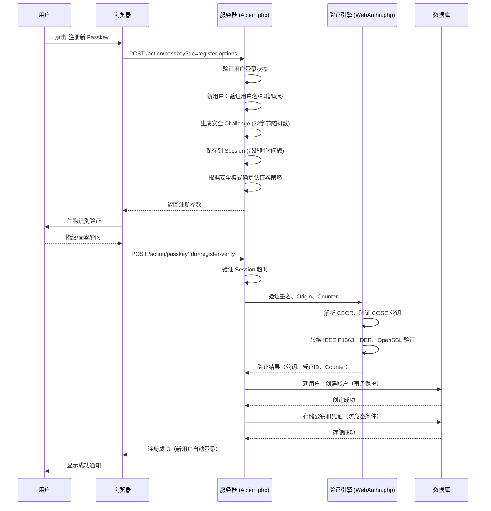
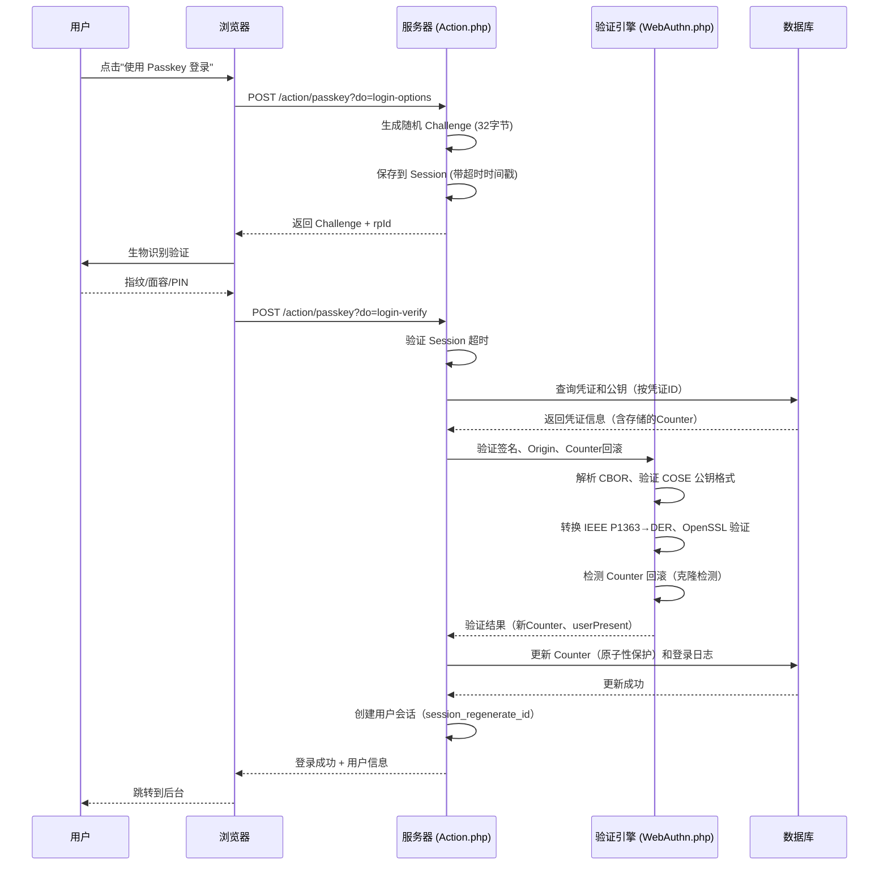
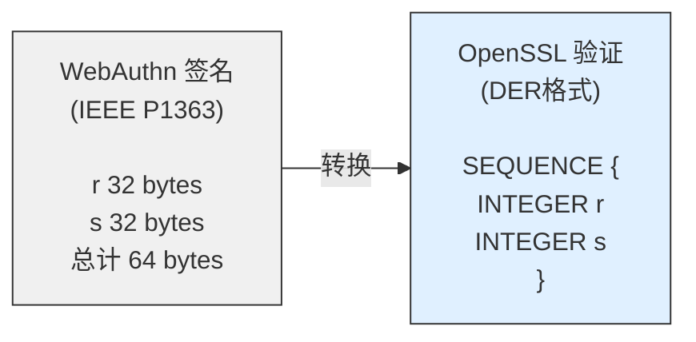

# Passkey 登录插件 for Typecho

一个为 Typecho 博客系统提供企业级 Passkey（WebAuthn）登录功能的插件，使用生物识别（指纹、面容）或设备 PIN 快速安全登录。


[](https://www.php.net/)


---

## 🔗 项目地址

为方便快速下载主题、插件和相关依赖，提供以下国内/国际地址：

| 项目 | 类型 | 国内地址 | 国际地址 |
| ---- | ---- | ---- | ---- |
| BooAdmin | 后台主题 | https://cnb.cool/little-gt/BooAdmin | https://github.com/little-gt/BooAdmin |
| Passkey | 配套插件 | https://cnb.cool/little-gt/Passkey | https://github.com/little-gt/Passkey |
| Passport | 配套插件 | https://cnb.cool/little-gt/Passport | https://github.com/little-gt/Passport |


来自腾讯云先锋会员 时宇（https://cnb.cool/u/coolerxde） 的系列开源项目，专注于提升 Typecho 1.3.0 的性能，用户体验，以及安全性。并且探索新的技术方向。

---

## 📸 截图预览

<h3>后台插件设置</h3>
<p align="center">
  
</p>
<p align="center">
  
</p>
<p align="center"><em>配置注入模式、RP 信息和注册选项</em></p>

<h3>Passkey 登录界面</h3>
<p align="center">
  
</p>
<p align="center"><em>后台登录页面启用 Passkey 登录</em></p>

<h3>Passkey 移动优化</h3>
<p align="center">
  
  
</p>
<p align="center"><em>移动端管理页面深度优化，轻松管理 Passkey 设置</em></p>

---

## ✨ 功能特性

### 🔐 核心功能
| 功能项 | 描述 |
|--------|------|
| Passkey 登录 | 使用生物识别（指纹、面容）或设备 PIN 快速登录 |
| 后台管理 | 在 Typecho 后台管理和绑定 Passkey |
| 登录记录 | 仪表盘查询近期 Passkey 登录历史，掌握账户安全状况 |
| 自动注入 | 自动在登录页面添加 Passkey 登录选项 |
| 手动模式 | 支持手动控制登录按钮的显示位置 |
| 多设备支持 | 可以绑定多个设备的 Passkey |
| 注册支持 | 允许新用户通过 Passkey 创建账户 |
| 认证器类型限制 | 支持平台验证器（Windows Hello、Touch ID）或跨平台验证器（Bitwarden、1Password、YubiKey） |
| 安全模式联动 | 严格模式下强制锁定为平台验证器，自定义模式恢复用户控制 |

### 🛡️ 企业级安全
| 功能项 | 描述 |
|--------|------|
| 完整签名验证 | 服务器端实现 ES256/RS256 算法验证（PHP OpenSSL） |
| IEEE P1363 ↔ DER | 自动转换 WebAuthn 签名格式兼容 OpenSSL |
| 速率限制 | 基于 Session 的注册/登录频率限制，防暴力破解 |
| Challenge 验证 | 可配置超时时间（60-600秒），防重放攻击 |
| 签名计数器 | 检测克隆的认证器（Clone Detection） |
| Origin 验证 | 严格/宽松模式，防域名欺骗 |
| 数据长度限制 | 防止恶意超大数据 DoS 攻击 |
| 安全日志记录 | 完整记录验证失败事件，便于审计 |
| 认证器类型限制 | 支持平台验证器（最高安全性）或跨平台验证器（便利性） |
| 安全模式联动 | 严格模式强制平台验证器，常规/开发模式可自由选择 |
| 会话固定防护 | 登录成功后重新生成 Session ID |
| 事务保护 | 数据库事务确保原子性，防竞态条件 |

### 🎨 用户体验
| 功能项 | 描述 |
|--------|------|
| 用户体验 | 优雅通知 | 网页内通知系统，无需弹窗 |
| 响应式设计 | 适配 Passport 设计系统（无荧光、无圆角、无阴影），完全支持移动端 |
| 触摸友好 | 按钮和交互元素适合触摸操作，支持移动设备 |
| 版本控制 | 资源文件带版本号，避免缓存 |
| 完整卸载 | 移除插件时可选删除所有数据 |

### 🌐 浏览器兼容
| 功能项 | 描述 |
|--------|------|
| 智能检测 | 自动识别浏览器类型和版本，支持 8+ 种设备检测方法 |
| Safari 适配 | Safari < 14 自动跳过不支持的选项，iOS 14.5+ 优化 |
| Firefox 增强 | 版本检查和友好错误提示，Firefox Android 92+ 支持 |
| 条件特性 | 动态调整 WebAuthn 选项，针对不同设备优化参数 |

---

## 🏗️ 系统架构

### 核心架构图



### 模块交互流程

#### 注册流程



#### 登录流程



---

## 📋 系统要求

### 服务器要求
- ✅ Typecho 1.0+
- ✅ PHP 7.0+ （推荐 7.4+）
- ✅ PHP 扩展：OpenSSL、mbstring、json、session
- ✅ MySQL 5.5+ / PostgreSQL 9.0+ / SQLite 3.0+
- ✅ HTTPS 环境（本地开发可使用 localhost）

**PHP 扩展检查：**
```bash
php -m | grep -E 'openssl|mbstring|json|session'
```

### 浏览器要求
- Chrome 67+（2018年5月）
- Firefox 60+（2018年5月）
- Safari 13+（2019年9月）
- Edge 18+（2018年11月）

### 平台支持
- ✅ Windows 10 1903+ (Windows Hello)
- ✅ macOS (Touch ID / Face ID)
- ✅ iOS 14.5+ (Face ID / Touch ID)
- ✅ iPadOS 13+ (Face ID / Touch ID)
- ✅ Android 7+ (指纹 / 面部识别)
- ✅ Linux (外部安全密钥)

---

## 📦 安装步骤

### 方法一：手动安装

1. **下载插件**
   ```bash
   cd /var/www/typecho/usr/plugins/
   # 上传或克隆 Passkey 文件夹
   ```

2. **设置权限**
   ```bash
   chmod -R 755 Passkey
   chown -R www-data:www-data Passkey
   ```

3. **目录结构确认**
   ```
   usr/plugins/Passkey/
   ├── Plugin.php          # 主插件类
   ├── Action.php         # API 处理类
   ├── Panel.php          # 管理面板
   ├── WebAuthn.php       # WebAuthn 验证类
   ├── LICENSE
   └── assist/
       ├── css/
       │   └── style.css   # 样式文件
       └── js/
           └── passkey.js  # 核心 JavaScript
   ```

4. **启用插件**
   - 登录 Typecho 后台
   - 进入「控制台」→「插件」
   - 找到 "Passkey" 插件，点击「启用」

5. **配置插件**
   - 点击「设置」进入配置页面
   - 根据需要配置各项选项

### 方法二：Git 克隆

```bash
cd /var/www/typecho/usr/plugins/
git clone https://github.com/little-gt/Passkey/Passkey.git
chmod -R 755 Passkey
```

---

## ⚙️ 插件配置

进入「控制台」→「插件」→「Passkey」→「设置」

### 1. 注入模式

#### 自动注入
插件会自动在 Typecho 登录页面注入 Passkey 登录按钮，无需修改任何代码。

**实现方式：**
- 在主题 `header.php` 中调用 `$this->header()` 时自动注入 CSS 和 JS 资源
- JavaScript 检测登录表单并自动插入 Passkey 登录按钮
- 支持多种主题结构，智能适配不同的表单布局

#### 手动添加
需要在主题登录页面中手动添加 Passkey 登录代码。

**步骤：**
1. 找到主题的登录模板文件（通常是 `themes/你的主题/login.php` 或 `page-login.php`）
2. 找到登录表单 `<form>...</form>`
3. 在表单结束标签 `</form>` 后面添加以下代码：

```php
<!-- Passkey 登录 -->
<link rel="stylesheet" href="<?php echo $this->options->pluginUrl; ?>/Passkey/assist/css/style.css?v=1.0.6">
<script>var PASSKEY_ACTION_URL = "<?php echo $this->options->index; ?>/action/passkey";</script>
<script src="<?php echo $this->options->pluginUrl; ?>/Passkey/assist/js/passkey.js?v=1.0.6"></script>
<div id="passkey-login-container" style="margin-top: 20px;">
    <div style="text-align: center; margin-bottom: 10px;">
        <span style="color: #999;">或</span>
    </div>
    <button type="button" id="passkey-login-btn" class="btn primary" style="width: 100%;">
        使用 Passkey 登录
    </button>
</div>
<script>
document.addEventListener('DOMContentLoaded', function() {
    var btn = document.getElementById('passkey-login-btn');
    if (btn) {
        btn.addEventListener('click', function() {
            PasskeyManager.login();
        });
    }
});
</script>
```

### 2. Relying Party 配置

**RP 名称**
- 显示给用户的网站名称，例如："我的博客"
- 这个名称会在用户注册 Passkey 时显示

**RP ID**
- 通常留空，插件会自动使用当前域名
- 如需指定，输入域名（不含协议和端口），例如："example.com"

### 3. 允许 Passkey 注册新用户

启用后，未登录用户可以在登录页面使用 Passkey 创建新账户（无需输入用户名密码）。

⚠️ **重要：此设置受 Typecho 全局注册设置控制**

- ✅ **全局注册已开启** - 此选项才能生效
- ❌ **全局注册已关闭** - 即使此处启用也无法注册

请先到「设置」→「基本」→「允许注册」中开启全局注册功能。

### 4. 认证器类型限制

控制注册 Passkey 时允许使用的认证器类型：

| 选项 | 说明 |
|------|------|
| **允许所有验证器**（推荐） | 支持平台验证器（Windows Hello、Touch ID）和跨平台验证器（Bitwarden、1Password、YubiKey） |
| **仅允许平台验证器** | 只允许设备内置认证器，安全性最高，但无法使用第三方密码管理器 |

⚠️ **重要：** 在**严格模式**下，无论此处如何设置都将强制使用"仅平台验证器"。

### 5. 安全模式配置

插件提供完整的安全配置系统，支持四种模式（三种预设 + 自定义）：

**四种安全模式：**

| 模式 | 适用场景 | 速率限制 | Challenge 超时 | Origin 验证 | 认证器限制 |
|------|---------|---------|---------------|------------|------------|
| **开发模式** | 开发/测试环境 | 50次/IP/小时 | 600秒 (10分钟) | 宽松模式 | 受认证器类型限制控制 |
| **常规模式** | 个人博客/小型站点 | 10次/IP/小时 | 300秒 (5分钟) | 标准验证 | 受认证器类型限制控制 |
| **严格模式** | 高安全需求场景 | 5次/IP/小时 | 180秒 (3分钟) | 严格匹配 | **强制平台验证器** |
| **自定义模式** | 特殊需求 | 自定义 | 自定义 | 自定义 | 受认证器类型限制控制 |

**安全模式联动规则：**

| 联动规则 | 触发条件 | 行为 |
|---------|---------|------|
| 严格模式锁定 | 选择严格模式 | 自动锁定"认证器类型限制"为"仅平台验证器"，禁止修改 |
| 自定义模式恢复 | 切换到自定义模式或手动修改参数 | 恢复"认证器类型限制"为可交互状态，保留用户之前的选择 |
| 参数变更检测 | 修改任何安全参数 | 自动检测是否偏离预设，偏离时切换到自定义模式 |

**可配置的安全参数（10+ 项）：**

| 配置项 | 范围 | 说明 |
|--------|------|------|
| **速率限制** |  |  |
| maxAttemptsPerIP | 1-100 | 每小时每 IP 最大尝试次数 |
| maxAttemptsPerHour | 1-100 | 每小时每用户最大尝试次数 |
| **会话管理** |  |  |
| sessionTimeout | 60-600秒 | Challenge 超时时间，防重放攻击 |
| **数据长度限制** |  |  |
| maxChallengeLength | 256-2048 | Challenge 最大长度（字节） |
| maxClientDataLength | 2048-16384 | ClientDataJSON 最大长度 |
| maxAttestationLength | 16384-131072 | AttestationObject 最大长度 |
| maxAuthDataLength | 16384-131072 | AuthenticatorData 最大长度 |
| maxSignatureLength | 256-2048 | 签名最大长度 |
| maxPublicKeyLength | 2048-16384 | 公钥最大长度 |
| **CBOR 安全** |  |  |
| maxCBORDepth | 5-20 | CBOR 解码最大深度（防递归攻击） |
| **验证策略** |  |  |
| originValidationMode | strict/standard/relaxed | Origin 验证模式 |

---

## 📖 使用说明

### 后台管理 Passkey

1. **进入管理页面**
   - 登录 Typecho 后台
   - 在左侧菜单找到「Passkey 管理」

2. **添加新凭证**
   - 点击右上角「注册新 Passkey」按钮
   - 根据设备提示完成生物识别或 PIN 验证
   - 绑定成功后，该设备即可使用 Passkey 登录

3. **管理凭证**
   - 查看所有已绑定的 Passkey（ID、凭证标识符、创建时间）
   - 删除不再使用的 Passkey

4. **查看登录记录**
   - 在仪表盘查看近期 Passkey 登录历史
   - 查看每次登录的时间、设备信息、IP 地址
   - 及时发现异常登录行为

### 使用 Passkey 登录

1. **访问登录页面**
   - 访问 Typecho 登录页面
   - 看到「🔐 使用 Passkey 登录」按钮

2. **进行身份验证**
   - 点击按钮
   - 按照浏览器提示完成身份验证（指纹/面容/PIN）

3. **自动登录**
   - 验证成功后自动登录并跳转到后台

### 新用户注册

如果启用了 Passkey 注册功能：

1. **触发注册流程**
   - 点击「使用 Passkey 登录」
   - 系统检测到设备未注册，弹出注册表单

2. **填写注册信息**
   - 用户名（3-32位，字母/数字/下划线）
   - 邮箱（有效邮箱地址）
   - 昵称（可选，默认为用户名）

3. **创建凭证**
   - 提交信息后进行生物识别
   - 系统自动创建账户并登录

---

## 🔧 技术实现

### WebAuthn 签名验证实现

插件实现了完整的服务器端 WebAuthn 签名验证，支持主流算法：

#### 支持的签名算法

| 算法 | COSE ID | 说明 | 实现方式 |
|------|---------|------|----------|
| **ES256** | -7 | ECDSA P-256 + SHA-256 | PHP OpenSSL + DER 转换 |
| **RS256** | -257 | RSA PKCS#1 + SHA-256 | PHP OpenSSL |

#### ES256 签名验证流程



**关键技术点：**
1. **格式转换**：WebAuthn 使用 IEEE P1363 格式（r||s），OpenSSL 需要 DER 格式
2. **公钥编码**：COSE 格式公钥 → DER 编码 → PEM 格式
3. **签名验证**：使用 PHP `openssl_verify()` 验证 SHA-256 签名

```php
// IEEE P1363 转 DER
private static function ieee1363ToDer($signature) {
    $r = substr($signature, 0, 32);
    $s = substr($signature, 32, 32);
    
    // 编码为 DER INTEGER
    $rDer = self::encodeDERInteger($r);
    $sDer = self::encodeDERInteger($s);
    
    // 构造 SEQUENCE
    return "\x30" . chr(strlen($rDer . $sDer)) . $rDer . $sDer;
}

// 验证 ES256 签名
private static function verifyES256($data, $signature, $publicKey) {
    // 自动检测并转换格式
    if (strlen($signature) === 64) {
        $signature = self::ieee1363ToDer($signature);
    }
    
    // 构造 PEM 格式公钥
    $pem = self::buildECPublicKeyPEM($publicKey['x'], $publicKey['y']);
    
    // OpenSSL 验证
    return openssl_verify($data, $signature, $pem, OPENSSL_ALGO_SHA256) === 1;
}
```

### 数据库结构

插件自动创建 2 个数据表，支持多数据库类型（MySQL、PostgreSQL、SQLite）：

#### 多数据库支持

| 数据库类型 | 主键自增语法 | 字符集 | 索引语法 |
|-----------|-------------|-------|---------|
| **MySQL** | `AUTO_INCREMENT` | `utf8mb4` | `INDEX` |
| **PostgreSQL** | `SERIAL` | `UTF8` | `CREATE INDEX` |
| **SQLite** | `AUTOINCREMENT` | `UTF-8` | `CREATE INDEX` |

#### 1. 凭证表 `typecho_passkey_credentials`

**MySQL 语法：**
```sql
CREATE TABLE typecho_passkey_credentials (
    id INT AUTO_INCREMENT PRIMARY KEY,
    user_id INT NOT NULL,
    credential_id VARCHAR(512) NOT NULL,
    public_key TEXT NOT NULL,
    counter INT DEFAULT 0,
    created_at INT NOT NULL,
    last_used INT DEFAULT NULL,
    UNIQUE KEY unique_credential (credential_id)
) ENGINE=InnoDB DEFAULT CHARSET=utf8mb4;
```

**PostgreSQL 语法：**
```sql
CREATE TABLE typecho_passkey_credentials (
    id SERIAL PRIMARY KEY,
    user_id INT NOT NULL,
    credential_id VARCHAR(512) NOT NULL,
    public_key TEXT NOT NULL,
    counter INT DEFAULT 0,
    created_at INT NOT NULL,
    last_used INT DEFAULT NULL
);
CREATE UNIQUE INDEX unique_credential ON typecho_passkey_credentials(credential_id);
```

**SQLite 语法：**
```sql
CREATE TABLE typecho_passkey_credentials (
    id INTEGER PRIMARY KEY AUTOINCREMENT,
    user_id INTEGER NOT NULL,
    credential_id VARCHAR(512) NOT NULL,
    public_key TEXT NOT NULL,
    counter INTEGER DEFAULT 0,
    created_at INTEGER NOT NULL,
    last_used INTEGER DEFAULT NULL
);
CREATE UNIQUE INDEX unique_credential ON typecho_passkey_credentials(credential_id);
```

**字段说明：**
- `id` - 主键
- `user_id` - 关联的 Typecho 用户 ID
- `credential_id` - WebAuthn 凭证唯一标识符（Base64 编码，最大 512 字符）
- `public_key` - COSE 格式公钥数据（Base64 编码）
- `counter` - 签名计数器（防重放攻击和克隆检测）
- `created_at` - 创建时间戳
- `last_used` - 最后使用时间戳

#### 2. 登录记录表 `typecho_passkey_login_logs`

**MySQL 语法：**
```sql
CREATE TABLE typecho_passkey_login_logs (
    id INT AUTO_INCREMENT PRIMARY KEY,
    user_id INT NOT NULL,
    credential_id INT NOT NULL,
    challenge TEXT NOT NULL,
    ip_address VARCHAR(45) NOT NULL,
    user_agent TEXT,
    login_time INT NOT NULL,
    status VARCHAR(20) DEFAULT 'success',
    INDEX idx_user_id (user_id),
    INDEX idx_login_time (login_time)
) ENGINE=InnoDB DEFAULT CHARSET=utf8mb4;
```

**PostgreSQL 语法：**
```sql
CREATE TABLE typecho_passkey_login_logs (
    id SERIAL PRIMARY KEY,
    user_id INT NOT NULL,
    credential_id INT NOT NULL,
    challenge TEXT NOT NULL,
    ip_address VARCHAR(45) NOT NULL,
    user_agent TEXT,
    login_time INT NOT NULL,
    status VARCHAR(20) DEFAULT 'success'
);
CREATE INDEX idx_user_id ON typecho_passkey_login_logs(user_id);
CREATE INDEX idx_login_time ON typecho_passkey_login_logs(login_time);
```

**SQLite 语法：**
```sql
CREATE TABLE typecho_passkey_login_logs (
    id INTEGER PRIMARY KEY AUTOINCREMENT,
    user_id INTEGER NOT NULL,
    credential_id INTEGER NOT NULL,
    challenge TEXT NOT NULL,
    ip_address VARCHAR(45) NOT NULL,
    user_agent TEXT,
    login_time INTEGER NOT NULL,
    status VARCHAR(20) DEFAULT 'success'
);
CREATE INDEX idx_user_id ON typecho_passkey_login_logs(user_id);
CREATE INDEX idx_login_time ON typecho_passkey_login_logs(login_time);
```

**字段说明：**
- `id` - 主键
- `user_id` - 关联的 Typecho 用户 ID
- `credential_id` - 使用的凭证 ID（外键关联 passkey_credentials.id）
- `challenge` - 本次登录使用的挑战值（用于审计）
- `ip_address` - 登录 IP 地址（支持 IPv4 和 IPv6）
- `user_agent` - 浏览器用户代理字符串
- `login_time` - 登录时间戳
- `status` - 登录状态（success/failed）

---

## 📡 API 文档

### API 端点

通过 `/action/passkey` 访问，支持以下操作：

| 端点 | 方法 | 说明 | 登录要求 |
|------|------|------|----------|
| `?do=register-options` | POST | 获取注册选项（支持新用户注册时传递注册信息） | 否 |
| `?do=register-verify` | POST | 验证注册凭证 | 否 |
| `?do=login-options` | POST | 获取登录选项 | 否 |
| `?do=login-verify` | POST | 验证登录凭证 | 否 |
| `?do=list` | GET | 列出用户的凭证 | 是 |
| `?do=login-logs` | GET | 获取登录历史记录 | 是 |
| `?do=delete` | POST | 删除凭证 | 是 |

### 详细 API 说明

#### 1. 获取注册选项
**Endpoint:** `POST /action/passkey?do=register-options`

**请求体（新用户注册时）：**
```json
{
  "username": "myusername",
  "email": "user@example.com",
  "screenName": "My Display Name"
}
```

**请求体（已登录用户添加凭证时）：**
```json
{}
```

**响应：**
```json
{
  "success": true,
  "data": {
    "challenge": "base64url_encoded_challenge",
    "rp": {
      "name": "My Website",
      "id": "example.com"
    },
    "user": {
      "id": "base64_encoded_user_id",
      "name": "username",
      "displayName": "Display Name"
    },
    "pubKeyCredParams": [
      {"type": "public-key", "alg": -7},
      {"type": "public-key", "alg": -257}
    ],
    "timeout": 60000,
    "attestation": "none",
    "authenticatorSelection": {
      "residentKey": "required",
      "requireResidentKey": true,
      "userVerification": "required"
    }
  }
}
```

**authenticatorSelection 说明：**
- **常规/开发模式**（允许跨平台验证器）：`residentKey: "required"`，支持 Bitwarden/1Password 等
- **严格模式**（仅平台验证器）：`authenticatorAttachment: "platform"`，仅支持 Windows Hello/Touch ID

#### 2. 验证注册凭证
**Endpoint:** `POST /action/passkey?do=register-verify`

**请求体：**
```json
{
  "id": "credential_id",
  "rawId": "credential_id",
  "type": "public-key",
  "response": {
    "clientDataJSON": "base64_encoded_client_data",
    "attestationObject": "base64_encoded_attestation"
  }
}
```

**响应（已登录用户添加凭证）：**
```json
{
  "success": true,
  "data": {
    "message": "Passkey registered successfully",
    "isNewUser": false
  }
}
```

**响应（新用户注册成功）：**
```json
{
  "success": true,
  "data": {
    "message": "注册成功！欢迎使用 Passkey 登录",
    "isNewUser": true,
    "redirect": "https://example.com/admin/"
  }
}
```

#### 3. 获取登录选项
**Endpoint:** `POST /action/passkey?do=login-options`

**请求体：**
```json
{}
```

**响应：**
```json
{
  "success": true,
  "data": {
    "challenge": "base64url_encoded_challenge",
    "timeout": 60000,
    "rpId": "example.com",
    "userVerification": "required"
  }
}
```

#### 4. 验证登录凭证
**Endpoint:** `POST /action/passkey?do=login-verify`

**请求体：**
```json
{
  "id": "credential_id",
  "rawId": "credential_id",
  "type": "public-key",
  "response": {
    "authenticatorData": "base64_encoded_auth_data",
    "clientDataJSON": "base64_encoded_client_data",
    "signature": "base64_encoded_signature"
  }
}
```

**响应（登录成功）：**
```json
{
  "success": true,
  "data": {
    "message": "登录成功",
    "redirect": "https://example.com/admin/",
    "user": {
      "name": "username",
      "screenName": "Display Name"
    }
  }
}
```

**响应（凭证未注册，需要注册）：**
```json
{
  "success": false,
  "needRegister": true,
  "error": "此设备尚未注册 Passkey"
}
```

#### 5. 列出凭证
**Endpoint:** `GET /action/passkey?do=list`

**响应：**
```json
{
  "success": true,
  "data": [
    {
      "id": 1,
      "credential_id": "YWJjZGVm...",
      "created_at": "2026-02-22 14:30:00"
    }
  ]
}
```

#### 6. 获取登录日志
**Endpoint:** `GET /action/passkey?do=login-logs&limit=20`

**参数：**
- `limit` - 返回记录数（1-100，默认 10）

**响应：**
```json
{
  "success": true,
  "data": [
    {
      "id": 1,
      "credential_id": "YWJjZGVm...",
      "ip_address": "192.168.1.1",
      "user_agent": "Chrome / Windows",
      "login_time": "2026-02-22 14:30:00",
      "status": "success"
    }
  ]
}
```

#### 7. 删除凭证
**Endpoint:** `POST /action/passkey?do=delete`

**请求体：**
```json
{
  "id": 1
}
```

**响应：**
```json
{
  "success": true,
  "data": {
    "message": "凭证已删除"
  }
}
```

### 错误响应格式

```json
{
  "success": false,
  "error": "错误信息",
  "errorCode": "ERR_VALIDATION" // 仅在调试模式显示
}
```

**错误代码：**

| 错误代码 | 说明 |
|---------|------|
| `ERR_VALIDATION` | 输入验证错误（用户名/邮箱格式、参数缺失等） |
| `ERR_AUTH_FAILED` | 认证失败（凭证不存在、签名验证失败等） |
| `ERR_ORIGIN_MISMATCH` | Origin 不匹配（域名欺骗检测） |
| `ERR_CREDENTIAL_LENGTH` | 凭证长度超限（超过数据库存储限制） |
| `ERR_DUPLICATE` | 重复凭证（同一凭证已注册或用户名/邮箱已被占用） |
| `ERR_RATE_LIMIT` | 速率限制（请求过于频繁） |
| `ERR_SESSION` | 会话错误（会话过期、信息丢失） |
| `ERR_NETWORK` | 网络错误 |
| `ERR_UNKNOWN` | 未知错误 |

---

## 🛡️ 安全性说明

### FIDO2/WebAuthn 标准

- 私钥永不离开设备，存储在 TPM、安全芯片或操作系统密钥库
- 防钓鱼：浏览器自动验证域名，无法跨域使用
- 防重放：每次认证使用一次性 challenge
- 无密码：无需记忆密码，避免密码泄露

### 插件安全措施

#### 核心安全机制
- **完整签名验证** - 服务器端实现 ES256/RS256 算法验证（PHP OpenSSL）
- **格式自动转换** - IEEE P1363 ↔ DER，兼容 OpenSSL
- **签名计数器** - 检测认证器克隆攻击（Counter 回滚检测）
- **Challenge 验证** - 可配置超时（60-600秒），一次性使用，防重放攻击
- **Origin 验证** - 三种模式（严格/标准/宽松），防域名欺骗
- **RP ID 安全构造** - 从站点配置读取，防 Host 头注入
- **速率限制** - 基于 Session，可配置限制（1-100次/小时）
- **数据长度限制** - 10+ 项可配置限制，防 DoS 攻击
- **CBOR 安全解析** - 限制嵌套深度（5-20层）和数据大小
- **输入验证** - 用户名、邮箱、凭证 ID 格式严格验证
- **重复检查** - 防止重复注册凭证，检测凭证重用
- **安全日志** - 完整记录验证失败事件，便于审计
- **会话保护** - Session 固定攻击防护，登录后重新生成 ID
- **事务保护** - 数据库事务确保原子性，防竞态条件

#### 三种安全配置模式

**🟢 开发模式（推荐：开发/测试环境）**
```
适用场景：开发环境、测试环境
速率限制：50次/IP/小时
Challenge 超时：600秒（10分钟）
Origin 验证：宽松模式（支持子域名和端口差异）
性能影响：极低
```

**🟡 常规模式（推荐：个人博客）**
```
适用场景：个人博客、小型站点（日均 PV < 1000）
速率限制：10次/IP/小时
Challenge 超时：300秒（5分钟）
Origin 验证：标准模式（验证协议和主域名）
性能影响：低
```

**🔴 严格模式（推荐：高安全需求）**
```
适用场景：金融/支付相关、高价值内容管理
速率限制：5次/IP/小时
Challenge 超时：180秒（3分钟）
Origin 验证：严格模式（完全匹配协议+域名+端口）
性能影响：中等
```

## 🔧 前端 API

### PasskeyManager 对象

```javascript
// 检查浏览器支持
if (PasskeyManager.isSupported()) {
    console.log('浏览器支持 WebAuthn');
} else {
    console.log('浏览器不支持，需要升级');
}

// 注册 Passkey（后台管理页面）
PasskeyManager.register()
    .then(result => {
        console.log('注册成功', result);
        // result 包含服务器返回的数据
    })
    .catch(error => {
        console.error('注册失败', error.message);
        // 错误类型：NotAllowedError, InvalidStateError 等
    });

// 使用 Passkey 登录（登录页面）
PasskeyManager.login()
    .then(result => {
        console.log('登录成功', result);
        // 自动跳转到 result.redirect
        window.location.href = result.redirect;
    })
    .catch(error => {
        console.error('登录失败', error.message);
    });

// 显示网页内通知
PasskeyManager.showNotification('操作成功', 'success');
PasskeyManager.showNotification('操作失败', 'error');
PasskeyManager.showNotification('提示信息', 'info');
```

### 通知系统

```javascript
// 样式类型
- success: 绿色，成功操作
- error: 红色，错误信息
- info: 蓝色，提示信息
- warning: 黄色，警告信息

// 特性
- 自动定位到页面顶部
- 5 秒后自动消失
- 支持多条通知队列
- 响应式设计，移动端友好
```

---

## 📜 版本说明

| 版本 | 日期 | 说明 | 更新内容 |
|------|------|------|----------|
| 1.2.0 | 2026-07-23 | 样式优化升级 | 对齐 BooAdmin 字体，提升用户体验 |
| 1.1.4 | 2026-07-15 | 数据库检测更新 | 优化数据库检测逻辑，避免由于不同版本的驱动前缀导致的检测错误 |
| 1.1.3 | 2026-07-01 | 多项质量更新 | 适配 MySQL、SQLite 和 PostgreSQL 数据库；优化在 BooAdmin 中的显示效果 |
| 1.1.2 | 2026-06-23 | 样式优化升级 | 暗色模式优化为黑色配色，减少视觉刺激，搭配 BooAdmin 使用体验更佳。 |
| 1.1.1 | 2026-06-04 | 支持切换平台验证器模式 | 新增"认证器类型限制"后台设置（允许所有验证器 / 仅允许平台验证器）、支持 Bitwarden / 1Password 等第三方密码管理器的 Passkey 功能、严格模式下强制锁定为平台验证器、安全模式与认证器类型限制联动控制（严格模式自动禁用选项并强制选中"仅平台验证器"，自定义模式恢复可用） |
| 1.1.0 | 2026-03-26 | 兼容 BooAdmin 暗色模式 | 在插件管理页面也可以体验原生的BooAdmin样式设计，一致性更强 |
| 1.0.6 | 2026-03-07 | 移动端兼容性全面优化 | 移动端响应式设计、iOS Safari/Android Chrome/Firefox 兼容性、智能浏览器检测、设备特定提示、触摸友好界面、渐进式降级、PWA 模式支持 |
| 1.0.5 | 2026-02-24 | 安全配置增强 | 三种预设安全级别（开发/常规/严格）、自定义安全参数调整、实时预览安全强度、移除不安全 Server 变量构造、强制从站点配置读取 siteUrl、增强域名格式验证防止 Host 头注入 |
| 1.0.4 | 2026-02-23 | 信息安全加固 | 全面信息脱敏（12 处敏感信息泄露）、统一错误处理机制（避免差异化攻击）、增强输入验证（防注入攻击）、优化错误日志记录（避免日志注入） |
| 1.0.3 | 2026-02-22 | 企业级安全解决方案 | ES256/RS256 签名验证（PHP OpenSSL 原生实现）、IEEE P1363 / DER 格式自动转换、Session 速率限制（防暴力破解）、Challenge 超时验证（防重放攻击）、签名计数器检测（防克隆认证器）、Origin 严格验证（防域名欺骗）、数据长度限制（防 DoS 攻击） |
| 1.0.2 | 2026-02-22 | 功能增强 | 登录历史记录查询、完整卸载支持、网页内通知系统 |
| 1.0.1 | - | 注册功能 | Passkey 新用户注册、注册表单弹窗（用户名/邮箱/昵称）、全局注册设置优先级控制 |
| 1.0.0 | - | 初始版本 | Passkey 注册和登录、后台管理界面、自动/手动注入模式、多设备支持 |

## 常见问题

### 1. 提示"不支持 WebAuthn"

**原因：**
- 未使用 HTTPS（生产环境要求）
- 浏览器版本过旧
- 浏览器隐私模式可能不支持

**解决方案：**
- 确保使用 HTTPS 或 localhost
- 更新浏览器到最新版本
- 退出隐私/无痕模式

### 2. Passkey 注册失败

**原因：**
- 设备不支持生物识别
- Windows Hello 未启用
- 浏览器权限被阻止

**解决方案：**
- 检查设备是否支持指纹/面容识别
- Windows 用户：设置 → 账户 → 登录选项 → Windows Hello
- 允许浏览器的权限请求弹窗

### 3. 登录页面没有 Passkey 按钮

**原因：**
- 未选择"自动注入"模式
- 主题结构不兼容
- JavaScript 加载失败

**解决方案：**
- 检查插件设置，确认选择了"自动注入"
- 查看浏览器控制台是否有错误
- 切换到"手动添加"模式，参考配置说明

### 4. 全局注册已关闭无法注册

**原因：**
- Typecho 全局注册设置关闭

**解决方案：**
- 进入「设置」→「基本」→「允许注册」
- 勾选"允许注册"复选框
- 保存设置后即可使用 Passkey 注册

### 5. 可以在多个设备上使用吗？

**答案：** 可以！

- 每个设备可以单独注册 Passkey
- 在后台"Passkey 管理"页面管理所有设备
- 建议至少绑定 2 个设备（主设备 + 备用）

### 6. 忘记密码还能登录吗？

**答案：** 可以！

- 如果已绑定 Passkey，即使忘记密码也可以通过 Passkey 登录
- 建议至少绑定一个可靠的设备作为备用

### 7. Passkey 比密码更安全吗？

**答案：** 是的，更安全！

- ✅ 防钓鱼（无法跨域使用）
- ✅ 防泄露（私钥不离开设备）
- ✅ 防暴力破解（生物识别）
- ✅ 防重放攻击（一次性 challenge）

### 8. 卸载插件会删除数据吗？

**答案：** 可以自由选择！

- 在卸载插件时，系统会询问是否删除所有数据
- ✅ **删除数据**：移除所有凭证、登录记录和配置（完全卸载）
- ❌ **保留数据**：仅停用插件，数据保留（方便重新启用）
- 建议：测试环境选择删除，生产环境谨慎选择

---

## 🐛 故障排查

### 启用调试模式

编辑 `config.inc.php`：

```php
/** 开启调试模式 */
define('__TYPECHO_DEBUG__', true);
```

### 查看浏览器控制台

按 F12 打开开发者工具：

```javascript
// 检查支持
console.log('WebAuthn 支持:', PasskeyManager.isSupported());

// 查看详细错误
PasskeyManager.login().catch(error => {
    console.error('错误名称:', error.name);
    console.error('错误信息:', error.message);
});
```

### 常见错误代码

| 错误 | 说明 | 解决方案 |
|------|------|----------|
| `NotAllowedError` | 用户取消或超时 | 重新尝试，不要取消弹窗 |
| `InvalidStateError` | 设备未注册 | 先在后台添加 Passkey |
| `NotSupportedError` | 设备不支持 | 更换支持的设备或浏览器 |
| `SecurityError` | 安全上下文错误 | 使用 HTTPS 或 localhost |

### 检查数据表

```sql
-- 查看数据表
SHOW TABLES LIKE '%passkey%';

-- 查看凭证数据
SELECT * FROM typecho_passkey_credentials;

-- 查看登录记录
SELECT * FROM typecho_passkey_login_logs ORDER BY login_time DESC LIMIT 10;

-- 检查表结构
DESC typecho_passkey_credentials;
DESC typecho_passkey_login_logs;
```

---

## 📄 许可证

本插件遵循 MIT 许可证开源。

**Made with ❤️ by GARFIELDTOM & little-AI**