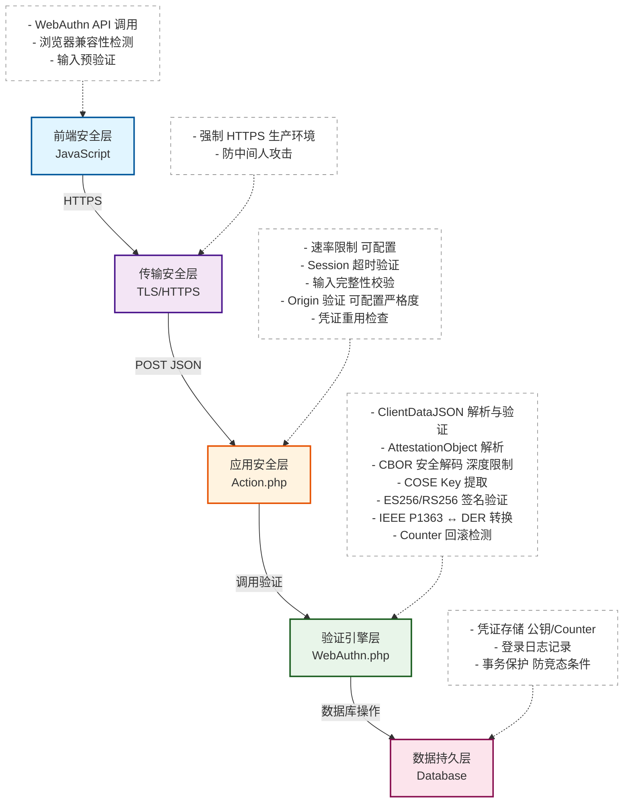
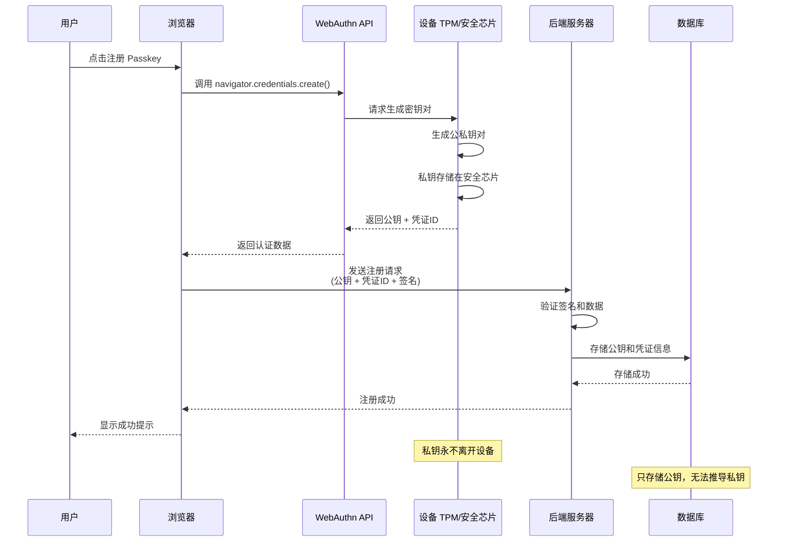
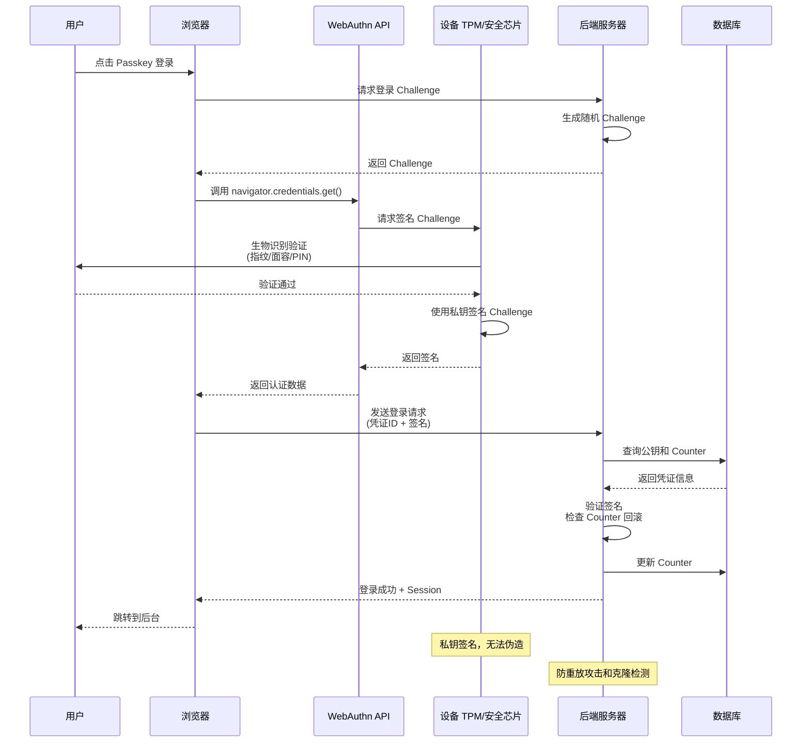

# Passkey 插件安全文档

**最后更新：** 2026年2月24日  
**当前版本：** v1.0.5

---

## 📋 目录

- [版本更新记录](#版本更新记录)
- [安全架构概览](#安全架构概览)
- [安全模式配置](#安全模式配置)
- [已知安全加固](#已知安全加固)
- [安全最佳实践](#安全最佳实践)
- [漏洞报告流程](#漏洞报告流程)

---

## 🔄 版本更新记录

### v1.0.5 (2026-02-24) - 安全配置增强

#### 🎯 核心更新

**1. 可配置安全模式**
- ✅ 三种预设安全级别：**平衡模式** / **标准模式** / **严格模式**
- ✅ 每种模式预配置了优化的安全参数组合
- ✅ 支持自定义模式，可独立调整 10+ 项安全参数
- ✅ 实时预览当前配置的安全强度和性能影响

**2. RP ID 与 Origin 验证优化**
- ✅ 移除不安全的动态 Server 变量构造
- ✅ 强制从站点配置读取 `siteUrl` 作为可信来源
- ✅ 增强域名格式验证，防止 Host 头注入攻击
- ✅ 严格模式下强制完全匹配（协议+域名+端口）
- ✅ 平衡/标准模式支持子域名和端口适配

#### 📊 安全参数可配置项

| 参数类别 | 可配置项 | 用途 |
|---------|---------|------|
| **速率限制** | 每小时/IP 最大尝试次数 | 防暴力破解 |
| **数据长度限制** | Challenge/ClientData/Attestation/Signature 等最大长度 | 防 DoS 攻击 |
| **会话管理** | Challenge 超时时间 | 防重放攻击 |
| **验证策略** | Origin 匹配模式（严格/宽松） | 平衡安全性与兼容性 |
| **CBOR 安全** | 最大解码深度 | 防递归攻击 |

#### 🔧 配置方式

**后台配置界面：**
```
控制台 → 插件 → Passkey → 设置 → 安全模式配置
```

**预设模式对比：**

| 模式 | 适用场景 | 速率限制 | 验证策略 | 性能影响 |
|------|---------|---------|---------|---------|
| **平衡** | 个人博客/小型站点 | 宽松 (20/IP) | 宽松 Origin | 极低 |
| **标准** | 中型站点/企业博客 | 适中 (10/IP) | 标准验证 | 低 |
| **严格** | 高安全需求场景 | 严格 (5/IP) | 严格匹配 | 中等 |
| **自定义** | 特殊需求 | 自定义 | 自定义 | 取决于配置 |

#### ⚠️ 安全建议

1. **生产环境推荐使用"标准"或"严格"模式**
2. **启用 HTTPS 后建议切换到"严格"模式**
3. **开发环境可使用"平衡"模式方便测试**
4. **定期检查登录日志，及时调整速率限制参数**

---

### v1.0.4 (2026-02-23) - 信息安全加固

#### 🔒 主要修复
- ✅ 全面信息脱敏（12 处敏感信息泄露）
- ✅ 统一错误处理机制（避免差异化攻击）
- ✅ 增强输入验证（防注入攻击）
- ✅ 优化错误日志记录（避免日志注入）

---

### v1.0.3 (2026-02-22) - 企业级安全解决方案

#### 🛡️ 核心安全特性
- ✅ 完整 ES256/RS256 签名验证（PHP OpenSSL 原生实现）
- ✅ IEEE P1363 ↔ DER 格式自动转换
- ✅ 基于 Session 的速率限制（防暴力破解）
- ✅ Challenge 超时验证（防重放攻击）
- ✅ 签名计数器检测（防克隆认证器）
- ✅ Origin 严格验证（防域名欺骗）
- ✅ 全面的数据长度限制（防 DoS 攻击）

---

## 🏗️ 安全架构概览

### 核心安全层



### 数据流安全

#### 1. 注册流程



#### 2. 登录流程



---

## 🎛️ 安全模式配置

### 配置入口

在 Typecho 管理后台：
```
控制台 → 插件 → Passkey → 设置 → 安全模式配置
```

### 预设模式详解

#### 🟢 平衡模式（推荐：个人博客）

**特点：** 安全性与易用性平衡，适合低风险场景

| 参数 | 值 | 说明 |
|------|----|----|
| 每小时/IP 尝试次数 | 20 | 同一 IP 每小时最多 20 次认证尝试 |
| 每小时/用户尝试次数 | 30 | 同一用户每小时最多 30 次认证尝试 |
| Challenge 超时 | 300s (5分钟) | Challenge 有效期 5 分钟 |
| Origin 验证模式 | 宽松 | 允许子域名和端口差异 |
| Challenge 最大长度 | 2048 | 允许较长的 Challenge |
| ClientData 最大长度 | 16384 | 16KB |

**适用场景：**
- 个人博客
- 小型站点（日均 PV < 1000）
- 开发/测试环境

---

#### 🟡 标准模式（推荐：企业博客）

**特点：** 主流安全标准，适合大多数生产环境

| 参数 | 值 | 说明 |
|------|----|----|
| 每小时/IP 尝试次数 | 10 | 同一 IP 每小时最多 10 次认证尝试 |
| 每小时/用户尝试次数 | 20 | 同一用户每小时最多 20 次认证尝试 |
| Challenge 超时 | 180s (3分钟) | Challenge 有效期 3 分钟 |
| Origin 验证模式 | 标准 | 验证协议和主域名 |
| Challenge 最大长度 | 1024 | WebAuthn 标准推荐值 |
| ClientData 最大长度 | 8192 | 8KB |

**适用场景：**
- 企业官网/博客
- 中型站点（日均 PV 1000-10000）
- 一般生产环境

---

#### 🔴 严格模式（推荐：高安全需求）

**特点：** 最高安全级别，最大化防护强度

| 参数 | 值 | 说明 |
|------|----|----|
| 每小时/IP 尝试次数 | 5 | 同一 IP 每小时最多 5 次认证尝试 |
| 每小时/用户尝试次数 | 10 | 同一用户每小时最多 10 次认证尝试 |
| Challenge 超时 | 60s (1分钟) | Challenge 有效期 1 分钟 |
| Origin 验证模式 | 严格 | 完全匹配协议+域名+端口 |
| Challenge 最大长度 | 512 | 最小安全长度 |
| ClientData 最大长度 | 4096 | 4KB |

**适用场景：**
- 金融/支付相关站点
- 高价值内容管理
- 已知攻击风险环境

---

#### ⚙️ 自定义模式

**可独立调整的参数：**

| 参数名称 | 默认值 | 范围 | 说明 |
|---------|--------|------|------|
| maxAttemptsPerIP | 10 | 1-100 | 每小时每 IP 最大尝试次数 |
| maxAttemptsPerUser | 20 | 1-100 | 每小时每用户最大尝试次数 |
| sessionTimeout | 180 | 60-600 | Challenge 超时时间（秒） |
| maxChallengeLength | 1024 | 256-2048 | Challenge 最大长度（字节） |
| maxClientDataLength | 8192 | 2048-16384 | ClientDataJSON 最大长度 |
| maxAttestationLength | 65536 | 16384-131072 | AttestationObject 最大长度 |
| maxAuthDataLength | 65536 | 16384-131072 | AuthenticatorData 最大长度 |
| maxSignatureLength | 1024 | 256-2048 | 签名最大长度 |
| maxPublicKeyLength | 8192 | 2048-16384 | 公钥最大长度 |
| maxCBORDepth | 10 | 5-20 | CBOR 解码最大深度 |
| originValidationMode | standard | strict/standard/relaxed | Origin 验证模式 |

**调优建议：**
1. **速率限制：** 根据站点流量调整，避免误杀正常用户
2. **超时时间：** 移动网络环境建议 ≥ 180s
3. **长度限制：** 在安全和兼容性之间平衡
4. **Origin 验证：** 多域名部署时使用 relaxed，其他时候用 strict

---

## 🛡️ 已知安全加固

### 1. CBOR 解码器整数溢出保护

**位置：** `WebAuthn.php` → `decodeCBORValue()`

**问题：** 32位系统上处理64位整数时可能溢出

**修复：**
```php
// 安全处理64位整数
if (PHP_INT_SIZE === 8) {
    // 64位系统直接计算
    $value = ($high << 32) | $low;
} else {
    // 32位系统只接受 < 2^32 的值
    if ($high !== 0) {
        throw new \Exception('64-bit integer too large for 32-bit system');
    }
    $value = $low;
}
```

---

### 2. DER 编码空字符串处理

**位置：** `WebAuthn.php` → `encodeDERInteger()`

**问题：** `ltrim()` 移除所有零后可能导致空字符串错误

**修复：**
```php
$value = ltrim($value, "\x00");
if (strlen($value) === 0) {
    $value = "\x00"; // 值为 0
} elseif (ord($value[0]) & 0x80) {
    $value = "\x00" . $value; // 添加符号位
}
```

---

### 3. RP ID 安全构造

**位置：** `Action.php` → `getSafeRpId()`

**v1.0.5 重大改进：**

❌ **旧方法（不安全）：**
```php
// 直接从 $_SERVER 读取，易受 Host 头注入攻击
$host = $_SERVER['HTTP_HOST'];
```

✅ **新方法（安全）：**
```php
// 从站点配置读取，避免动态构造
$options = \Widget\Options::alloc();
$siteUrl = $options->siteUrl; // 从数据库配置读取
$host = parse_url($siteUrl, PHP_URL_HOST);

// 增强格式验证
if (!preg_match('/^[a-zA-Z0-9][a-zA-Z0-9\-\.]*[a-zA-Z0-9]$/', $host)) {
    throw new \Exception('Invalid hostname format');
}
```

**防御的攻击：**
- Host 头注入
- DNS 重绑定
- 伪造域名欺骗

---

### 4. Origin 验证增强

**位置：** `WebAuthn.php` → `verifyOrigin()`

**v1.0.5 支持三种验证模式：**

```php
// 严格模式：完全匹配
if ($mode === 'strict') {
    return $clientOrigin === $expectedOrigin;
}

// 标准模式：协议+主域名匹配
if ($mode === 'standard') {
    return $clientScheme === $expectedScheme && 
           $clientHost === $expectedHost;
}

// 宽松模式：允许子域名和端口差异
if ($mode === 'relaxed') {
    return $clientScheme === $expectedScheme && 
           (isSameDomain($clientHost, $expectedHost));
}
```

---

### 5. 凭证重用检查

**位置：** `Action.php` → `registerVerify()`

**防御：** 防止同一凭证 ID 被多次注册

```php
$existingCred = $this->db->fetchRow(
    $this->db->select()
        ->from($this->prefix . 'passkey_credentials')
        ->where('credential_id = ?', $credentialId)
        ->limit(1)
);

if ($existingCred) {
    throw new \Exception('Credential ID already exists');
}
```

---

### 6. 会话固定攻击防护

**位置：** `Action.php` → `registerVerify()` & `loginVerify()`

**防御：** 登录成功后重新生成 Session ID

```php
if (session_status() === PHP_SESSION_ACTIVE) {
    session_regenerate_id(true);
}
```

---

### 7. Counter 回滚检测

**位置：** `Action.php` → `loginVerify()`

**防御：** 检测克隆的认证器

```php
if ($verifyResult['counter'] <= $credential['counter']) {
    error_log('Passkey: Counter rollback detected - possible cloned authenticator');
    // 可选：标记凭证为可疑
}

// 更新 Counter（使用行锁防止并发）
$this->db->query(
    $this->db->update($this->prefix . 'passkey_credentials')
        ->rows(['counter' => $verifyResult['counter']])
        ->where('id = ?', $credential['id'])
);
```

---

### 8. 数据库事务保护

**位置：** `Action.php` → `registerVerify()`

**防御：** 防止用户注册时的竞态条件

```php
// 开启事务
if (method_exists($this->db, 'beginTransaction')) {
    $this->db->beginTransaction();
}

try {
    // 再次检查用户名/邮箱是否被占用
    // 创建用户
    // 绑定凭证
    
    if (method_exists($this->db, 'commit')) {
        $this->db->commit();
    }
} catch (\Exception $e) {
    if (method_exists($this->db, 'rollback')) {
        $this->db->rollback();
    }
    throw $e;
}
```

---

## 📖 安全最佳实践

### 部署前检查清单

- [ ] **HTTPS 已启用**（生产环境强制要求）
- [ ] **OpenSSL 扩展已安装** (`php -m | grep openssl`)
- [ ] **Session 配置安全** (`session.cookie_httponly = 1`, `session.cookie_secure = 1`)
- [ ] **站点 URL 配置正确** (Typecho 设置 → 站点地址)
- [ ] **安全模式已选择** (标准/严格模式推荐用于生产)
- [ ] **RP ID 配置正确** (通常为站点主域名)
- [ ] **备份数据库** (升级前备份凭证表)

### 生产环境推荐配置

```
安全模式：标准模式 或 严格模式
RP ID：example.com (主域名，不含协议)
允许注册：关闭 (除非有公开注册需求)
Origin 验证：严格模式 (strict)
HTTPS：强制启用
```

### 监控与审计

1. **定期检查登录日志**
   - 路径：Passkey 管理 → 登录记录
   - 关注：异常 IP、失败尝试激增

2. **审计速率限制触发**
   - 查看服务器错误日志：`/var/log/php-fpm/error.log`
   - 搜索关键词：`Rate limit exceeded`

3. **Counter 回滚告警**
   - 搜索关键词：`Counter rollback detected`
   - 出现时立即检查用户凭证

### 安全维护

- **定期更新插件** (关注 GitHub Releases)
- **定期备份凭证数据** (`passkey_credentials` 表)
- **监控 PHP 错误日志** (及时发现异常)
- **定期清理过期登录日志** (可选，减少数据库负担)

---

## 🔍 漏洞报告流程

### 如何报告安全漏洞

如果您发现了 Passkey 插件的安全漏洞，请通过以下方式报告：

1. **优先级高：** 发送邮件至 [security@garfieldtom.cool](mailto:security@garfieldtom.cool)
2. **备用方式：** 在 GitHub 创建 Private Security Advisory
3. **禁止公开：** 请勿在公开 Issue 中披露安全细节

### 报告应包含的信息

- 漏洞描述（详细说明漏洞原理）
- 影响范围（哪些版本受影响）
- 复现步骤（PoC 代码或操作流程）
- 严重性评估（您的主观判断）
- 修复建议（可选）

### 响应时间

- **确认收到：** 24 小时内
- **初步评估：** 72 小时内
- **修复发布：** 7-14 天内（取决于严重性）

### 致谢

我们会在修复发布后公开致谢安全研究人员（除非您要求匿名）。

---

## 📚 参考资料

- [WebAuthn 规范 (W3C)](https://www.w3.org/TR/webauthn-2/)
- [FIDO2 标准 (FIDO Alliance)](https://fidoalliance.org/fido2/)
- [OWASP Authentication Cheat Sheet](https://cheatsheetseries.owasp.org/cheatsheets/Authentication_Cheat_Sheet.html)
- [PHP OpenSSL 文档](https://www.php.net/manual/en/book.openssl.php)

---

## 📄 许可证

本插件遵循 MIT 许可证开源。

**Made with ❤️ by GARFIELDTOM**
